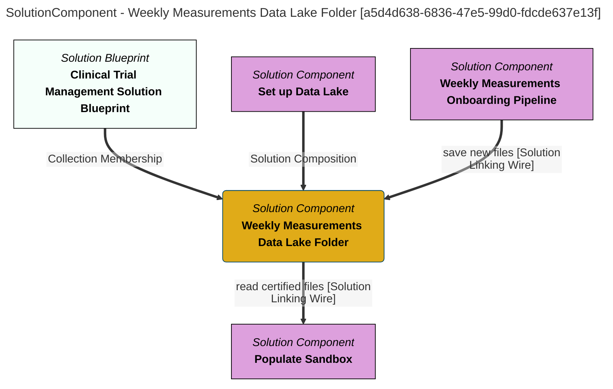

```mermaid
---
title: SolutionComponent - Weekly Measurements Data Lake Folder [a5d4d638-6836-47e5-99d0-fdcde637e13f]
---
flowchart TD
%%{init: {"flowchart": {"htmlLabels": false}} }%%

1@{ shape: rounded, label: "*Solution Component*
**Weekly Measurements Data Lake Folder**"}
2@{ shape: rect, label: "*Solution Blueprint*
**Clinical Trial Management Solution Blueprint**"}
2==>|"Collection Membership"|1
3@{ shape: rect, label: "*Solution Component*
**Set up Data Lake**"}
3==>|"Solution Composition"|1
4@{ shape: rect, label: "*Solution Component*
**Weekly Measurements Onboarding Pipeline**"}
4==>|"save new files [Solution Linking Wire]"|1
5@{ shape: rect, label: "*Solution Component*
**Populate Sandbox**"}
1==>|"read certified files [Solution Linking Wire]"|5
style 1 color:#000000, fill:#e0ab18, stroke:#004563
style 2 color:#000000, fill:#f5fffa, stroke:#000000
style 3 color:#000000, fill:#dda0dd, stroke:#000000
style 4 color:#000000, fill:#dda0dd, stroke:#000000
style 5 color:#000000, fill:#dda0dd, stroke:#000000
```
> Weekly Measurements Data Lake Folder: The directory where the files from the hospitals are assembled for sharing. (Extracted from V1.0)
