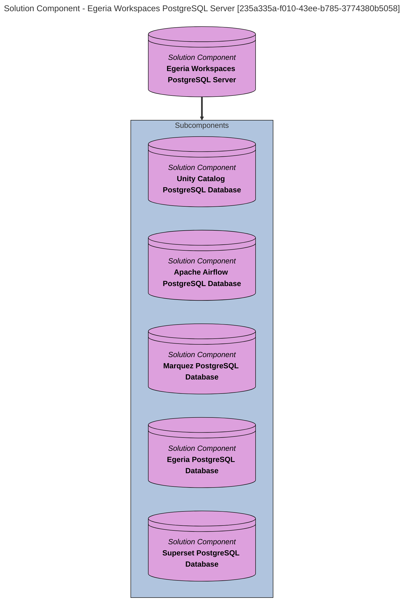

```mermaid
---
title: Solution Component - Egeria Workspaces PostgreSQL Server [235a335a-f010-43ee-b785-3774380b5058]
---
flowchart TD
%%{init: {"flowchart": {"htmlLabels": false}} }%%

1@{ shape: lin-cyl, label: "*Solution Component*
**Egeria Workspaces PostgreSQL Server**"}
subgraph 2 [Subcomponents]
3@{ shape: lin-cyl, label: "*Solution Component*
**Unity Catalog PostgreSQL Database**"}
4@{ shape: lin-cyl, label: "*Solution Component*
**Apache Airflow PostgreSQL Database**"}
5@{ shape: lin-cyl, label: "*Solution Component*
**Marquez PostgreSQL Database**"}
6@{ shape: lin-cyl, label: "*Solution Component*
**Egeria PostgreSQL Database**"}
7@{ shape: lin-cyl, label: "*Solution Component*
**Superset PostgreSQL Database**"}
end
1==>2
style 1 color:#000000, fill:#dda0dd, stroke:#000000
style 2 color:#000000, fill:#b0c4de, stroke:#000000
style 3 color:#000000, fill:#dda0dd, stroke:#000000
style 4 color:#000000, fill:#dda0dd, stroke:#000000
style 5 color:#000000, fill:#dda0dd, stroke:#000000
style 6 color:#000000, fill:#dda0dd, stroke:#000000
style 7 color:#000000, fill:#dda0dd, stroke:#000000
click 1 "https://www.postgresql.org/" "Click for more documentation" _blank
click 3 "https://www.postgresql.org/" "Click for more documentation" _blank
click 4 "https://www.postgresql.org/" "Click for more documentation" _blank
click 5 "https://www.postgresql.org/" "Click for more documentation" _blank
click 7 "https://www.postgresql.org/" "Click for more documentation" _blank
```
> Egeria Workspaces PostgreSQL Server: Hosts relational databases for the Egeria Workspaces deployment. (Extracted from 6.0-SNAPSHOT)
