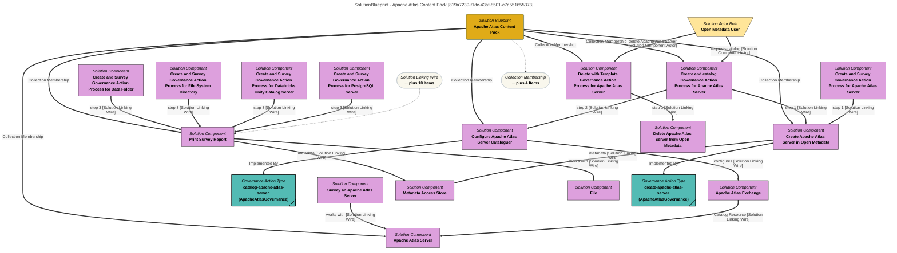

```mermaid
---
title: SolutionBlueprint - Apache Atlas Content Pack [819a7239-f1dc-43af-8501-c7a551655373]
---
flowchart TD
%%{init: {"flowchart": {"htmlLabels": false}} }%%

1@{ shape: rounded, label: "*Solution Blueprint*
**Apache Atlas Content Pack**"}
2@{ shape: rect, label: "*Solution Component*
**Configure Apache Atlas Server Cataloguer**"}
1==>|"Collection Membership"|2
3@{ shape: rect, label: "*Solution Component*
**Apache Atlas Exchange**"}
2==>|"configures [Solution Linking Wire]"|3
4@{ shape: rect, label: "*Solution Component*
**Create and catalog Governance Action Process for Apache Atlas Server**"}
4==>|"step 2 [Solution Linking Wire]"|2
5@{ shape: tag-rect, label: "*Governance Action Type*
**catalog-apache-atlas-server (ApacheAtlasGovernance)**"}
2==>|"Implemented By"|5
6@{ shape: rect, label: "*Solution Component*
**Apache Atlas Server**"}
1==>|"Collection Membership"|6
7@{ shape: rect, label: "*Solution Component*
**Survey an Apache Atlas Server**"}
7==>|"works with [Solution Linking Wire]"|6
3==>|"Catalog Resource [Solution Linking Wire]"|6
8@{ shape: rect, label: "*Solution Component*
**Print Survey Report**"}
1==>|"Collection Membership"|8
9@{ shape: rect, label: "*Solution Component*
**Create and Survey Governance Action Process for Data Folder**"}
9==>|"step 3 [Solution Linking Wire]"|8
10@{ shape: rect, label: "*Solution Component*
**Metadata Access Store**"}
8==>|"metadata [Solution Linking Wire]"|10
11@{ shape: rect, label: "*Solution Component*
**Create and Survey Governance Action Process for File System Directory**"}
11==>|"step 3 [Solution Linking Wire]"|8
12@{ shape: rect, label: "*Solution Component*
**Create and Survey Governance Action Process for Databricks Unity Catalog Server**"}
12==>|"step 3 [Solution Linking Wire]"|8
13@{ shape: rect, label: "*Solution Component*
**File**"}
8==>|"works with [Solution Linking Wire]"|13
14@{ shape: rect, label: "*Solution Component*
**Create and Survey Governance Action Process for PostgreSQL Server**"}
14==>|"step 3 [Solution Linking Wire]"|8
15@{ shape: stadium, label: "*Solution Linking Wire*
**... plus 10 Items**"}
15-.->8
16@{ shape: rect, label: "*Solution Component*
**Create Apache Atlas Server in Open Metadata**"}
1==>|"Collection Membership"|16
4==>|"step 1 [Solution Linking Wire]"|16
16==>|"metadata [Solution Linking Wire]"|10
17@{ shape: rect, label: "*Solution Component*
**Create and Survey Governance Action Process for Apache Atlas Server**"}
17==>|"step 1 [Solution Linking Wire]"|16
18@{ shape: tag-rect, label: "*Governance Action Type*
**create-apache-atlas-server (ApacheAtlasGovernance)**"}
16==>|"Implemented By"|18
1==>|"Collection Membership"|4
19@{ shape: trap-t, label: "*Solution Actor Role*
**Open Metadata User**"}
19==>|"requests catalog [Solution Component Actor]"|4
20@{ shape: rect, label: "*Solution Component*
**Delete with Template Governance Action Process for Apache Atlas Server**"}
1==>|"Collection Membership"|20
19==>|"delete Apache Atlas Server [Solution Component Actor]"|20
21@{ shape: rect, label: "*Solution Component*
**Delete Apache Atlas Server from Open Metadata**"}
20==>|"step 1 [Solution Linking Wire]"|21
22@{ shape: stadium, label: "*Collection Membership*
**... plus 4 Items**"}
1-.->22
style 11 color:#000000, fill:#dda0dd, stroke:#000000
style 22 color:#000000, fill:#F9F7ED, stroke:#b7c0c7
style 12 color:#000000, fill:#dda0dd, stroke:#000000
style 13 color:#000000, fill:#dda0dd, stroke:#000000
style 14 color:#000000, fill:#dda0dd, stroke:#000000
style 15 color:#000000, fill:#F9F7ED, stroke:#b7c0c7
style 16 color:#000000, fill:#dda0dd, stroke:#000000
style 17 color:#000000, fill:#dda0dd, stroke:#000000
style 18 color:#000000, fill:#53bbb4, stroke:#000000
style 19 color:#000000, fill:#FFE599, stroke:#000000
style 1 color:#000000, fill:#e0ab18, stroke:#004563
style 2 color:#000000, fill:#dda0dd, stroke:#000000
style 3 color:#000000, fill:#dda0dd, stroke:#000000
style 4 color:#000000, fill:#dda0dd, stroke:#000000
style 5 color:#000000, fill:#53bbb4, stroke:#000000
style 6 color:#000000, fill:#dda0dd, stroke:#000000
style 7 color:#000000, fill:#dda0dd, stroke:#000000
style 8 color:#000000, fill:#dda0dd, stroke:#000000
style 9 color:#000000, fill:#dda0dd, stroke:#000000
style 20 color:#000000, fill:#dda0dd, stroke:#000000
style 10 color:#000000, fill:#dda0dd, stroke:#000000
style 21 color:#000000, fill:#dda0dd, stroke:#000000
click 11 "https://egeria-project.org/egeria-solutions/leveraging-files/overview/" "Click for more documentation" _blank
click 12 "https://egeria-project.org/egeria-solutions/leveraging-unity-catalog/overview/" "Click for more documentation" _blank
click 13 "https://egeria-project.org/types/2/0220-Files-and-Folders/" "Click for more documentation" _blank
click 14 "https://egeria-project.org/egeria-solutions/leveraging-postgres/overview/" "Click for more documentation" _blank
click 16 "https://egeria-project.org/concepts/governance-action-type/" "Click for more documentation" _blank
click 17 "https://egeria-project.org/egeria-solutions/leveraging-apache-atlas/overview/" "Click for more documentation" _blank
click 2 "https://egeria-project.org/concepts/governance-action-type/" "Click for more documentation" _blank
click 3 "https://egeria-project.org/concepts/integration-connector/" "Click for more documentation" _blank
click 4 "https://egeria-project.org/egeria-solutions/leveraging-apache-atlas/overview/" "Click for more documentation" _blank
click 6 "https://atlas.apache.org/" "Click for more documentation" _blank
click 7 "https://egeria-project.org/concepts/governance-action-type/" "Click for more documentation" _blank
click 8 "https://egeria-project.org/concepts/governance-action-type/" "Click for more documentation" _blank
click 9 "https://egeria-project.org/egeria-solutions/leveraging-files/overview/" "Click for more documentation" _blank
click 20 "https://egeria-project.org/egeria-solutions/leveraging-apache-atlas/overview/" "Click for more documentation" _blank
click 10 "https://egeria-project.org/concepts/metadata-access-store/" "Click for more documentation" _blank
click 21 "https://egeria-project.org/concepts/governance-action-type/" "Click for more documentation" _blank
```
> Apache Atlas Content Pack: Solution blueprint supporting integration connectors connecting to Apache Atlas. (Extracted from 6.0-SNAPSHOT)
