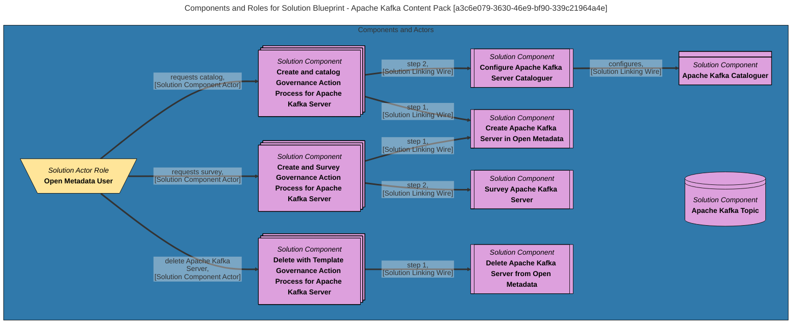

```mermaid
---
title: Components and Roles for Solution Blueprint - Apache Kafka Content Pack [a3c6e079-3630-46e9-bf90-339c21964a4e]
---
flowchart TD
%%{init: {"flowchart": {"htmlLabels": false}} }%%

subgraph 1 [Components and Actors]
2@{ shape: div-rect, label: "*Solution Component*
**Apache Kafka Cataloguer**"}
3@{ shape: subproc, label: "*Solution Component*
**Configure Apache Kafka Server Cataloguer**"}
4@{ shape: lin-cyl, label: "*Solution Component*
**Apache Kafka Topic**"}
5@{ shape: processes, label: "*Solution Component*
**Delete with Template Governance Action Process for Apache Kafka Server**"}
6@{ shape: subproc, label: "*Solution Component*
**Create Apache Kafka Server in Open Metadata**"}
7@{ shape: processes, label: "*Solution Component*
**Create and Survey Governance Action Process for Apache Kafka Server**"}
8@{ shape: processes, label: "*Solution Component*
**Create and catalog Governance Action Process for Apache Kafka Server**"}
9@{ shape: subproc, label: "*Solution Component*
**Survey Apache Kafka Server**"}
10@{ shape: subproc, label: "*Solution Component*
**Delete Apache Kafka Server from Open Metadata**"}
3==>|"configures,
[Solution Linking Wire]"|2
8==>|"step 2,
[Solution Linking Wire]"|3
11@{ shape: trap-t, label: "*Solution Actor Role*
**Open Metadata User**"}
11==>|"delete Apache Kafka Server,
[Solution Component Actor]"|5
5==>|"step 1,
[Solution Linking Wire]"|10
8==>|"step 1,
[Solution Linking Wire]"|6
7==>|"step 1,
[Solution Linking Wire]"|6
11==>|"requests survey,
[Solution Component Actor]"|7
7==>|"step 2,
[Solution Linking Wire]"|9
11==>|"requests catalog,
[Solution Component Actor]"|8
end
style 11 color:#000000, fill:#FFE599, stroke:#000000
style 1 color:#FFFFFF, fill:#3079ab, stroke:#000000
style 2 color:#000000, fill:#dda0dd, stroke:#000000
style 3 color:#000000, fill:#dda0dd, stroke:#000000
style 4 color:#000000, fill:#dda0dd, stroke:#000000
style 5 color:#000000, fill:#dda0dd, stroke:#000000
style 6 color:#000000, fill:#dda0dd, stroke:#000000
style 7 color:#000000, fill:#dda0dd, stroke:#000000
style 8 color:#000000, fill:#dda0dd, stroke:#000000
style 9 color:#000000, fill:#dda0dd, stroke:#000000
style 10 color:#000000, fill:#dda0dd, stroke:#000000
click 2 "https://egeria-project.org/concepts/integration-connector/" "Click for more documentation" _blank
click 3 "https://egeria-project.org/concepts/governance-action-type/" "Click for more documentation" _blank
click 4 "https://kafka.apache.org/" "Click for more documentation" _blank
click 5 "https://egeria-project.org/egeria-solutions/leveraging-apache-kafka/overview/" "Click for more documentation" _blank
click 6 "https://egeria-project.org/concepts/governance-action-type/" "Click for more documentation" _blank
click 7 "https://egeria-project.org/egeria-solutions/leveraging-apache-kafka/overview/" "Click for more documentation" _blank
click 8 "https://egeria-project.org/egeria-solutions/leveraging-apache-kafka/overview/" "Click for more documentation" _blank
click 9 "https://egeria-project.org/concepts/governance-action-type/" "Click for more documentation" _blank
click 10 "https://egeria-project.org/concepts/governance-action-type/" "Click for more documentation" _blank
```
> Apache Kafka Content Pack: Solution blueprint supporting integration connectors connecting to Apache Kafka. (Extracted from 6.0-SNAPSHOT)
