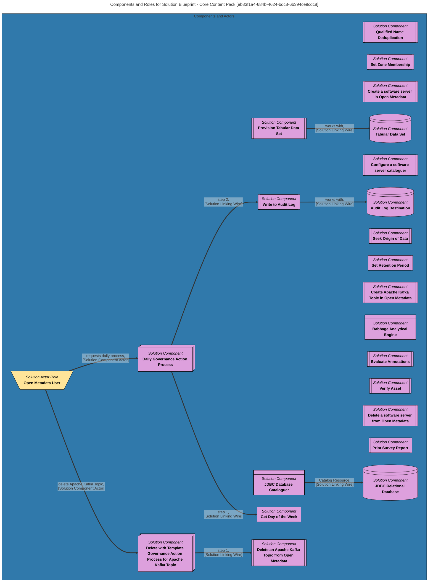

```mermaid
---
title: Components and Roles for Solution Blueprint - Core Content Pack [eb83f1a4-684b-4624-bdc8-6b394ce9cdc8]
---
flowchart TD
%%{init: {"flowchart": {"htmlLabels": false}} }%%

subgraph 1 [Components and Actors]
2@{ shape: div-rect, label: "*Solution Component*
**JDBC Database Cataloguer**"}
3@{ shape: subproc, label: "*Solution Component*
**Qualified Name Deduplication**"}
4@{ shape: subproc, label: "*Solution Component*
**Provision Tabular Data Set**"}
5@{ shape: subproc, label: "*Solution Component*
**Set Zone Membership**"}
6@{ shape: subproc, label: "*Solution Component*
**Create a software server in Open Metadata**"}
7@{ shape: lin-cyl, label: "*Solution Component*
**Tabular Data Set**"}
8@{ shape: subproc, label: "*Solution Component*
**Configure a software server cataloguer**"}
9@{ shape: lin-cyl, label: "*Solution Component*
**Audit Log Destination**"}
10@{ shape: processes, label: "*Solution Component*
**Delete with Template Governance Action Process for Apache Kafka Topic**"}
11@{ shape: subproc, label: "*Solution Component*
**Seek Origin of Data**"}
12@{ shape: subproc, label: "*Solution Component*
**Write to Audit Log**"}
13@{ shape: subproc, label: "*Solution Component*
**Set Retention Period**"}
14@{ shape: subproc, label: "*Solution Component*
**Get Day of the Week**"}
15@{ shape: subproc, label: "*Solution Component*
**Create Apache Kafka Topic in Open Metadata**"}
16@{ shape: div-rect, label: "*Solution Component*
**Babbage Analytical Engine**"}
17@{ shape: subproc, label: "*Solution Component*
**Evaluate Annotations**"}
18@{ shape: subproc, label: "*Solution Component*
**Verify Asset**"}
19@{ shape: subproc, label: "*Solution Component*
**Delete an Apache Kafka Topic from Open Metadata**"}
20@{ shape: subproc, label: "*Solution Component*
**Delete a software server from Open Metadata**"}
21@{ shape: subproc, label: "*Solution Component*
**Print Survey Report**"}
22@{ shape: lin-cyl, label: "*Solution Component*
**JDBC Relational Database**"}
23@{ shape: processes, label: "*Solution Component*
**Daily Governance Action Process**"}
2==>|"Catalog Resource,
[Solution Linking Wire]"|22
4==>|"works with,
[Solution Linking Wire]"|7
12==>|"works with,
[Solution Linking Wire]"|9
24@{ shape: trap-t, label: "*Solution Actor Role*
**Open Metadata User**"}
24==>|"delete Apache Kafka Topic,
[Solution Component Actor]"|10
10==>|"step 1,
[Solution Linking Wire]"|19
23==>|"step 2,
[Solution Linking Wire]"|12
23==>|"step 1,
[Solution Linking Wire]"|14
24==>|"requests daily process,
[Solution Component Actor]"|23
end
style 11 color:#000000, fill:#dda0dd, stroke:#000000
style 22 color:#000000, fill:#dda0dd, stroke:#000000
style 12 color:#000000, fill:#dda0dd, stroke:#000000
style 23 color:#000000, fill:#dda0dd, stroke:#000000
style 13 color:#000000, fill:#dda0dd, stroke:#000000
style 24 color:#000000, fill:#FFE599, stroke:#000000
style 14 color:#000000, fill:#dda0dd, stroke:#000000
style 15 color:#000000, fill:#dda0dd, stroke:#000000
style 16 color:#000000, fill:#dda0dd, stroke:#000000
style 17 color:#000000, fill:#dda0dd, stroke:#000000
style 18 color:#000000, fill:#dda0dd, stroke:#000000
style 19 color:#000000, fill:#dda0dd, stroke:#000000
style 1 color:#FFFFFF, fill:#3079ab, stroke:#000000
style 2 color:#000000, fill:#dda0dd, stroke:#000000
style 3 color:#000000, fill:#dda0dd, stroke:#000000
style 4 color:#000000, fill:#dda0dd, stroke:#000000
style 5 color:#000000, fill:#dda0dd, stroke:#000000
style 6 color:#000000, fill:#dda0dd, stroke:#000000
style 7 color:#000000, fill:#dda0dd, stroke:#000000
style 8 color:#000000, fill:#dda0dd, stroke:#000000
style 9 color:#000000, fill:#dda0dd, stroke:#000000
style 20 color:#000000, fill:#dda0dd, stroke:#000000
style 10 color:#000000, fill:#dda0dd, stroke:#000000
style 21 color:#000000, fill:#dda0dd, stroke:#000000
click 11 "https://egeria-project.org/concepts/governance-action-type/" "Click for more documentation" _blank
click 22 "https://en.wikipedia.org/wiki/Java_Database_Connectivity" "Click for more documentation" _blank
click 12 "https://egeria-project.org/concepts/governance-action-type/" "Click for more documentation" _blank
click 23 "https://egeria-project.org/concepts/guard/" "Click for more documentation" _blank
click 13 "https://egeria-project.org/concepts/governance-action-type/" "Click for more documentation" _blank
click 14 "https://egeria-project.org/concepts/governance-action-type/" "Click for more documentation" _blank
click 15 "https://egeria-project.org/concepts/governance-action-type/" "Click for more documentation" _blank
click 16 "https://egeria-project.org/concepts/integration-connector/" "Click for more documentation" _blank
click 17 "https://egeria-project.org/concepts/governance-action-type/" "Click for more documentation" _blank
click 18 "https://egeria-project.org/concepts/governance-action-type/" "Click for more documentation" _blank
click 19 "https://egeria-project.org/concepts/governance-action-type/" "Click for more documentation" _blank
click 2 "https://egeria-project.org/concepts/integration-connector/" "Click for more documentation" _blank
click 3 "https://egeria-project.org/concepts/governance-action-type/" "Click for more documentation" _blank
click 4 "https://egeria-project.org/concepts/governance-action-type/" "Click for more documentation" _blank
click 5 "https://egeria-project.org/concepts/governance-action-type/" "Click for more documentation" _blank
click 6 "https://egeria-project.org/concepts/governance-action-type/" "Click for more documentation" _blank
click 7 "https://egeria-project.org/concepts/tabular-data-set/" "Click for more documentation" _blank
click 8 "https://egeria-project.org/concepts/governance-action-type/" "Click for more documentation" _blank
click 9 "https://egeria-project.org/concepts/audit-log/" "Click for more documentation" _blank
click 20 "https://egeria-project.org/concepts/governance-action-type/" "Click for more documentation" _blank
click 10 "https://egeria-project.org/egeria-solutions/leveraging-apache-kafka/overview/" "Click for more documentation" _blank
click 21 "https://egeria-project.org/concepts/governance-action-type/" "Click for more documentation" _blank
```
> Core Content Pack: Solution blueprint for a default setup. (Extracted from 6.0-SNAPSHOT)
