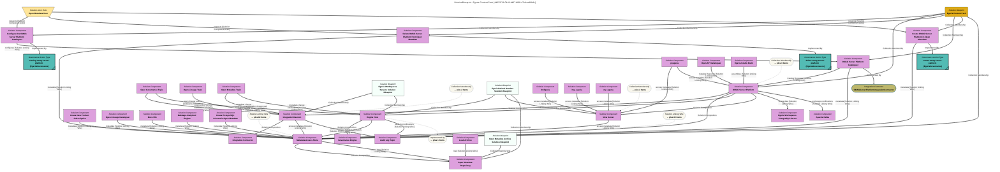

```mermaid
---
title: SolutionBlueprint - Egeria Content Pack [4d033711-0449-4d67-bf98-c7bfcae86b8c]
---
flowchart TD
%%{init: {"flowchart": {"htmlLabels": false}} }%%

1@{ shape: rounded, label: "*Solution Blueprint*
**Egeria Content Pack**"}
2@{ shape: rect, label: "*Solution Component*
**Configure the OMAG Server Platform Cataloguer**"}
1==>|"Collection Membership"|2
3@{ shape: trap-t, label: "*Solution Actor Role*
**Open Metadata User**"}
3==>|"requests [Solution Component Actor]"|2
4@{ shape: rect, label: "*Solution Component*
**OMAG Server Platform Cataloguer**"}
2==>|"configures [Solution Linking Wire]"|4
5@{ shape: tag-rect, label: "*Governance Action Type*
**catalog-omag-server-platform (EgeriaGovernance)**"}
2==>|"Implemented By"|5
6@{ shape: rect, label: "*Solution Component*
**OMAG Server Platform**"}
1==>|"Collection Membership"|6
7@{ shape: rect, label: "*Solution Component*
**Integration Daemon**"}
6==>|"Solution Composition"|7
8@{ shape: rect, label: "*Solution Component*
**Integration Connector**"}
7==>|"Solution Composition"|8
9@{ shape: rect, label: "*Solution Component*
**Open Governance Topic**"}
9==>|"configuration change notifications [Solution Linking Wire]"|7
10@{ shape: rect, label: "*Solution Component*
**Open Lineage Topic**"}
10==>|"open lineage events [Solution Linking Wire]"|7
11@{ shape: rect, label: "*Solution Component*
**Metadata Access Store**"}
7==>|"access metadata [Solution Linking Wire]"|11
12@{ shape: rect, label: "*Solution Component*
**Open Metadata Topic**"}
12==>|"metadata change notifications [Solution Linking Wire]"|7
13@{ shape: rect, label: "*Solution Component*
**Audit Log Topic**"}
7==>|"audit log notifications [Solution Linking Wire]"|13
14@{ shape: rect, label: "*Solution Blueprint*
**Egeria Workspaces Servers Solution Blueprint**"}
14==>|"Collection Membership"|7
15@{ shape: stadium, label: "*Collection Membership*
**... plus 2 Items**"}
15-.->7
6==>|"Solution Composition"|11
16@{ shape: rect, label: "*Solution Component*
**Open Metadata Repository**"}
11==>|"Solution Composition"|16
17@{ shape: rect, label: "*Solution Component*
**Create New Product Subscription**"}
17==>|"metadata [Solution Linking Wire]"|11
18@{ shape: rect, label: "*Solution Component*
**Open Lineage Cataloguer**"}
18==>|"metadata [Solution Linking Wire]"|11
19@{ shape: rect, label: "*Solution Component*
**Move File**"}
19==>|"metadata [Solution Linking Wire]"|11
20@{ shape: rect, label: "*Solution Component*
**Babbage Analytical Engine**"}
20==>|"metadata [Solution Linking Wire]"|11
21@{ shape: rect, label: "*Solution Component*
**Create PostgreSQL Schema in Open Metadata**"}
21==>|"metadata [Solution Linking Wire]"|11
22@{ shape: rect, label: "*Solution Component*
**Delete OMAG Server Platform from Open Metadata**"}
22==>|"metadata [Solution Linking Wire]"|11
23@{ shape: stadium, label: "*Solution Linking Wire*
**... plus 82 Items**"}
23-.->11
24@{ shape: rect, label: "*Solution Component*
**Engine Host**"}
6==>|"Solution Composition"|24
25@{ shape: rect, label: "*Solution Component*
**Governance Engine**"}
24==>|"Solution Composition"|25
9==>|"configuration change and engine action notifications [Solution Linking Wire]"|24
24==>|"access metadata [Solution Linking Wire]"|11
24==>|"audit log notifications [Solution Linking Wire]"|13
12==>|"metadata change notifications [Solution Linking Wire]"|24
14==>|"Collection Membership"|24
26@{ shape: rect, label: "*Solution Blueprint*
**Egeria Default Runtime Solution Blueprint**"}
26==>|"Collection Membership"|24
27@{ shape: stadium, label: "*Implemented By*
**... plus 1 Items**"}
24-.->27
28@{ shape: rect, label: "*Solution Component*
**View Server**"}
6==>|"Solution Composition"|28
29@{ shape: rect, label: "*Solution Component*
**Dr.Egeria**"}
29==>|"access metadata [Solution Linking Wire]"|28
30@{ shape: rect, label: "*Solution Component*
**hey_egeria**"}
30==>|"access metadata [Solution Linking Wire]"|28
28==>|"access metadata [Solution Linking Wire]"|11
31@{ shape: rect, label: "*Solution Component*
**my_egeria**"}
31==>|"access metadata [Solution Linking Wire]"|28
32@{ shape: rect, label: "*Solution Component*
**pyegeria**"}
32==>|"access metadata [Solution Linking Wire]"|28
26==>|"Collection Membership"|28
33@{ shape: stadium, label: "*Collection Membership*
**... plus 2 Items**"}
33-.->28
34@{ shape: rect, label: "*Solution Component*
**Egeria Workspaces PostgreSQL Server**"}
6==>|"stores data [Solution Linking Wire]"|34
35@{ shape: rect, label: "*Solution Component*
**Open API Cataloguer**"}
35==>|"Catalog Resource [Solution Linking Wire]"|6
36@{ shape: rect, label: "*Solution Component*
**Apache Kafka**"}
6==>|"exchanges notifications [Solution Linking Wire]"|36
32==>|"access metadata [Solution Linking Wire]"|6
4==>|"Catalog Resource [Solution Linking Wire]"|6
37@{ shape: rect, label: "*Solution Component*
**Egeria Gradle Build**"}
37==>|"assembles [Solution Linking Wire]"|6
38@{ shape: stadium, label: "*Collection Membership*
**... plus 3 Items**"}
38-.->6
1==>|"Collection Membership"|22
3==>|"requests [Solution Component Actor]"|22
39@{ shape: tag-rect, label: "*Governance Action Type*
**delete-omag-server-platform (EgeriaGovernance)**"}
22==>|"Implemented By"|39
1==>|"Collection Membership"|4
4==>|"metadata [Solution Linking Wire]"|11
40@{ shape: stadium, label: "*Integration Connector*
**OMAGServerPlatformIntegrationConnector**"}
4==>|"Implemented By"|40
41@{ shape: rect, label: "*Solution Component*
**Create OMAG Server Platform in Open Metadata**"}
1==>|"Collection Membership"|41
3==>|"requests [Solution Component Actor]"|41
41==>|"metadata [Solution Linking Wire]"|11
42@{ shape: tag-rect, label: "*Governance Action Type*
**create-omag-server-platform (EgeriaGovernance)**"}
41==>|"Implemented By"|42
1==>|"Collection Membership"|11
43@{ shape: rect, label: "*Solution Component*
**Load Archive**"}
43==>|"load [Solution Linking Wire]"|16
11==>|"stores data [Solution Linking Wire]"|16
44@{ shape: rect, label: "*Solution Blueprint*
**Open Metadata Archive Solution Blueprint**"}
44==>|"Collection Membership"|16
26==>|"Collection Membership"|16
45@{ shape: stadium, label: "*Solution Linking Wire*
**... plus 82 Items**"}
45-.->11
style 22 color:#000000, fill:#dda0dd, stroke:#000000
style 44 color:#000000, fill:#f5fffa, stroke:#000000
style 23 color:#000000, fill:#F9F7ED, stroke:#b7c0c7
style 45 color:#000000, fill:#F9F7ED, stroke:#b7c0c7
style 24 color:#000000, fill:#dda0dd, stroke:#000000
style 25 color:#000000, fill:#dda0dd, stroke:#000000
style 26 color:#000000, fill:#f5fffa, stroke:#000000
style 27 color:#000000, fill:#F9F7ED, stroke:#b7c0c7
style 28 color:#000000, fill:#dda0dd, stroke:#000000
style 29 color:#000000, fill:#dda0dd, stroke:#000000
style 30 color:#000000, fill:#dda0dd, stroke:#000000
style 31 color:#000000, fill:#dda0dd, stroke:#000000
style 10 color:#000000, fill:#dda0dd, stroke:#000000
style 32 color:#000000, fill:#dda0dd, stroke:#000000
style 11 color:#000000, fill:#dda0dd, stroke:#000000
style 33 color:#000000, fill:#F9F7ED, stroke:#b7c0c7
style 12 color:#000000, fill:#dda0dd, stroke:#000000
style 34 color:#000000, fill:#dda0dd, stroke:#000000
style 13 color:#000000, fill:#dda0dd, stroke:#000000
style 35 color:#000000, fill:#dda0dd, stroke:#000000
style 14 color:#000000, fill:#f5fffa, stroke:#000000
style 36 color:#000000, fill:#dda0dd, stroke:#000000
style 15 color:#000000, fill:#F9F7ED, stroke:#b7c0c7
style 37 color:#000000, fill:#dda0dd, stroke:#000000
style 16 color:#000000, fill:#dda0dd, stroke:#000000
style 38 color:#000000, fill:#F9F7ED, stroke:#b7c0c7
style 17 color:#000000, fill:#dda0dd, stroke:#000000
style 39 color:#000000, fill:#53bbb4, stroke:#000000
style 18 color:#000000, fill:#dda0dd, stroke:#000000
style 19 color:#000000, fill:#dda0dd, stroke:#000000
style 1 color:#000000, fill:#e0ab18, stroke:#004563
style 2 color:#000000, fill:#dda0dd, stroke:#000000
style 3 color:#000000, fill:#FFE599, stroke:#000000
style 4 color:#000000, fill:#dda0dd, stroke:#000000
style 5 color:#000000, fill:#53bbb4, stroke:#000000
style 6 color:#000000, fill:#dda0dd, stroke:#000000
style 7 color:#000000, fill:#dda0dd, stroke:#000000
style 8 color:#000000, fill:#dda0dd, stroke:#000000
style 9 color:#000000, fill:#dda0dd, stroke:#000000
style 40 color:#000000, fill:#bdb76b, stroke:#004563
style 41 color:#000000, fill:#dda0dd, stroke:#000000
style 20 color:#000000, fill:#dda0dd, stroke:#000000
style 42 color:#000000, fill:#53bbb4, stroke:#000000
style 21 color:#000000, fill:#dda0dd, stroke:#000000
style 43 color:#000000, fill:#dda0dd, stroke:#000000
click 22 "https://egeria-project.org/concepts/governance-action-type/" "Click for more documentation" _blank
click 24 "https://egeria-project.org/concepts/engine-host/" "Click for more documentation" _blank
click 25 "https://egeria-project.org/concepts/governance-engine/" "Click for more documentation" _blank
click 28 "https://egeria-project.org/concepts/metadata-access-server/" "Click for more documentation" _blank
click 30 "https://egeria-project.org/user-interfaces/hey-egeria/overview/" "Click for more documentation" _blank
click 10 "https://egeria-project.org/features/lineage-management/overview/#egerias-open-lineage-support" "Click for more documentation" _blank
click 32 "https://egeria-project.org/concepts/pyegeria/" "Click for more documentation" _blank
click 11 "https://egeria-project.org/concepts/metadata-access-store/" "Click for more documentation" _blank
click 12 "https://egeria-project.org/concepts/open-metadata-topic-connector/" "Click for more documentation" _blank
click 34 "https://www.postgresql.org/" "Click for more documentation" _blank
click 13 "https://egeria-project.org/concepts/audit-log-destination-connector/" "Click for more documentation" _blank
click 35 "https://egeria-project.org/concepts/integration-connector/" "Click for more documentation" _blank
click 36 "https://kafka.apache.org/" "Click for more documentation" _blank
click 16 "https://egeria-project.org/concepts/open-metadata-repository/" "Click for more documentation" _blank
click 17 "https://egeria-project.org/concepts/governance-action-type/" "Click for more documentation" _blank
click 18 "https://egeria-project.org/concepts/integration-connector/" "Click for more documentation" _blank
click 19 "https://egeria-project.org/concepts/governance-action-type/" "Click for more documentation" _blank
click 2 "https://egeria-project.org/concepts/governance-action-type/" "Click for more documentation" _blank
click 4 "https://egeria-project.org/concepts/integration-connector/" "Click for more documentation" _blank
click 6 "https://egeria-project.org/concepts/omag-server-platform/" "Click for more documentation" _blank
click 7 "https://egeria-project.org/concepts/integration-daemon/" "Click for more documentation" _blank
click 8 "https://egeria-project.org/services/omvs/analytics-integrator/overview" "Click for more documentation" _blank
click 9 "https://egeria-project.org/concepts/open-metadata-topic-connector/" "Click for more documentation" _blank
click 41 "https://egeria-project.org/concepts/governance-action-type/" "Click for more documentation" _blank
click 20 "https://egeria-project.org/concepts/integration-connector/" "Click for more documentation" _blank
click 21 "https://egeria-project.org/concepts/governance-action-type/" "Click for more documentation" _blank
click 43 "https://egeria-project.org/concepts/open-metadata-archive/" "Click for more documentation" _blank
```
> Egeria Content Pack: Solution blueprint containing integration connectors for working with Egeria''s infrastructure. (Extracted from 6.0-SNAPSHOT)
