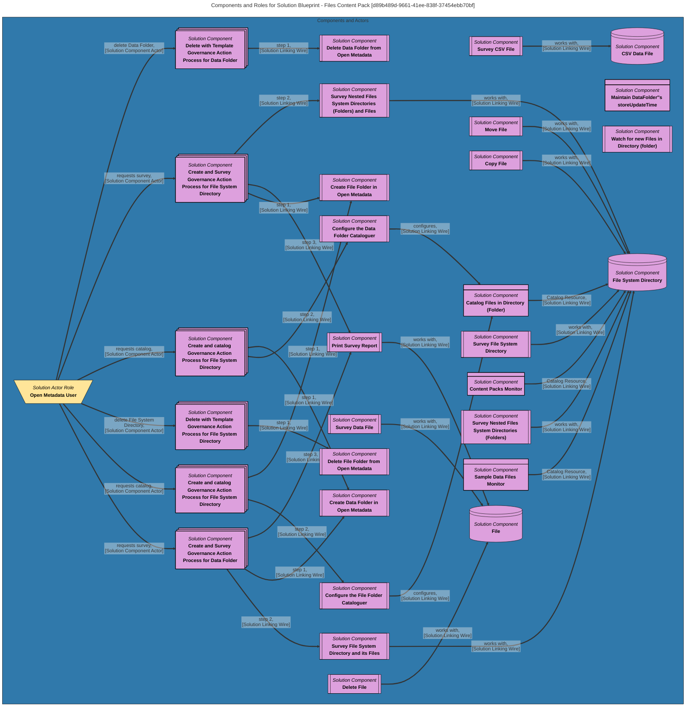

```mermaid
---
title: Components and Roles for Solution Blueprint - Files Content Pack [d89b489d-9661-41ee-838f-37454ebb70bf]
---
flowchart TD
%%{init: {"flowchart": {"htmlLabels": false}} }%%

subgraph 1 [Components and Actors]
2@{ shape: lin-cyl, label: "*Solution Component*
**File System Directory**"}
3@{ shape: subproc, label: "*Solution Component*
**Survey CSV File**"}
4@{ shape: lin-cyl, label: "*Solution Component*
**File**"}
5@{ shape: subproc, label: "*Solution Component*
**Move File**"}
6@{ shape: processes, label: "*Solution Component*
**Delete with Template Governance Action Process for Data Folder**"}
7@{ shape: subproc, label: "*Solution Component*
**Survey Nested Files System Directories (Folders) and Files**"}
8@{ shape: subproc, label: "*Solution Component*
**Print Survey Report**"}
9@{ shape: subproc, label: "*Solution Component*
**Create File Folder in Open Metadata**"}
10@{ shape: subproc, label: "*Solution Component*
**Copy File**"}
11@{ shape: processes, label: "*Solution Component*
**Create and Survey Governance Action Process for File System Directory**"}
12@{ shape: processes, label: "*Solution Component*
**Create and catalog Governance Action Process for File System Directory**"}
13@{ shape: div-rect, label: "*Solution Component*
**Catalog Files in Directory (Folder)**"}
14@{ shape: processes, label: "*Solution Component*
**Delete with Template Governance Action Process for File System Directory**"}
15@{ shape: subproc, label: "*Solution Component*
**Create Data Folder in Open Metadata**"}
16@{ shape: subproc, label: "*Solution Component*
**Survey File System Directory**"}
17@{ shape: div-rect, label: "*Solution Component*
**Content Packs Monitor**"}
18@{ shape: subproc, label: "*Solution Component*
**Delete File Folder from Open Metadata**"}
19@{ shape: subproc, label: "*Solution Component*
**Survey Data File**"}
20@{ shape: subproc, label: "*Solution Component*
**Configure the Data Folder Cataloguer**"}
21@{ shape: subproc, label: "*Solution Component*
**Delete Data Folder from Open Metadata**"}
22@{ shape: subproc, label: "*Solution Component*
**Configure the File Folder Cataloguer**"}
23@{ shape: div-rect, label: "*Solution Component*
**Maintain DataFolder''s storeUpdateTime**"}
24@{ shape: processes, label: "*Solution Component*
**Create and catalog Governance Action Process for File System Directory**"}
25@{ shape: subproc, label: "*Solution Component*
**Survey Nested Files System Directories (Folders)**"}
26@{ shape: subproc, label: "*Solution Component*
**Survey File System Directory and its Files**"}
27@{ shape: processes, label: "*Solution Component*
**Create and Survey Governance Action Process for Data Folder**"}
28@{ shape: div-rect, label: "*Solution Component*
**Sample Data Files Monitor**"}
29@{ shape: subproc, label: "*Solution Component*
**Delete File**"}
30@{ shape: subproc, label: "*Solution Component*
**Watch for new Files in Directory (folder)**"}
31@{ shape: lin-cyl, label: "*Solution Component*
**CSV Data File**"}
5==>|"works with,
[Solution Linking Wire]"|2
16==>|"works with,
[Solution Linking Wire]"|2
7==>|"works with,
[Solution Linking Wire]"|2
10==>|"works with,
[Solution Linking Wire]"|2
13==>|"Catalog Resource,
[Solution Linking Wire]"|2
28==>|"Catalog Resource,
[Solution Linking Wire]"|2
26==>|"works with,
[Solution Linking Wire]"|2
25==>|"works with,
[Solution Linking Wire]"|2
17==>|"Catalog Resource,
[Solution Linking Wire]"|2
3==>|"works with,
[Solution Linking Wire]"|31
29==>|"works with,
[Solution Linking Wire]"|4
8==>|"works with,
[Solution Linking Wire]"|4
19==>|"works with,
[Solution Linking Wire]"|4
32@{ shape: trap-t, label: "*Solution Actor Role*
**Open Metadata User**"}
32==>|"delete Data Folder,
[Solution Component Actor]"|6
6==>|"step 1,
[Solution Linking Wire]"|21
11==>|"step 2,
[Solution Linking Wire]"|7
27==>|"step 3,
[Solution Linking Wire]"|8
11==>|"step 3,
[Solution Linking Wire]"|8
11==>|"step 1,
[Solution Linking Wire]"|9
24==>|"step 1,
[Solution Linking Wire]"|9
32==>|"requests survey,
[Solution Component Actor]"|11
32==>|"requests catalog,
[Solution Component Actor]"|12
12==>|"step 1,
[Solution Linking Wire]"|15
12==>|"step 2,
[Solution Linking Wire]"|20
22==>|"configures,
[Solution Linking Wire]"|13
20==>|"configures,
[Solution Linking Wire]"|13
32==>|"delete File System Directory,
[Solution Component Actor]"|14
14==>|"step 1,
[Solution Linking Wire]"|18
27==>|"step 1,
[Solution Linking Wire]"|15
24==>|"step 2,
[Solution Linking Wire]"|22
32==>|"requests catalog,
[Solution Component Actor]"|24
27==>|"step 2,
[Solution Linking Wire]"|26
32==>|"requests survey,
[Solution Component Actor]"|27
end
style 22 color:#000000, fill:#dda0dd, stroke:#000000
style 23 color:#000000, fill:#dda0dd, stroke:#000000
style 24 color:#000000, fill:#dda0dd, stroke:#000000
style 25 color:#000000, fill:#dda0dd, stroke:#000000
style 26 color:#000000, fill:#dda0dd, stroke:#000000
style 27 color:#000000, fill:#dda0dd, stroke:#000000
style 28 color:#000000, fill:#dda0dd, stroke:#000000
style 29 color:#000000, fill:#dda0dd, stroke:#000000
style 30 color:#000000, fill:#dda0dd, stroke:#000000
style 31 color:#000000, fill:#dda0dd, stroke:#000000
style 10 color:#000000, fill:#dda0dd, stroke:#000000
style 32 color:#000000, fill:#FFE599, stroke:#000000
style 11 color:#000000, fill:#dda0dd, stroke:#000000
style 12 color:#000000, fill:#dda0dd, stroke:#000000
style 13 color:#000000, fill:#dda0dd, stroke:#000000
style 14 color:#000000, fill:#dda0dd, stroke:#000000
style 15 color:#000000, fill:#dda0dd, stroke:#000000
style 16 color:#000000, fill:#dda0dd, stroke:#000000
style 17 color:#000000, fill:#dda0dd, stroke:#000000
style 18 color:#000000, fill:#dda0dd, stroke:#000000
style 19 color:#000000, fill:#dda0dd, stroke:#000000
style 1 color:#FFFFFF, fill:#3079ab, stroke:#000000
style 2 color:#000000, fill:#dda0dd, stroke:#000000
style 3 color:#000000, fill:#dda0dd, stroke:#000000
style 4 color:#000000, fill:#dda0dd, stroke:#000000
style 5 color:#000000, fill:#dda0dd, stroke:#000000
style 6 color:#000000, fill:#dda0dd, stroke:#000000
style 7 color:#000000, fill:#dda0dd, stroke:#000000
style 8 color:#000000, fill:#dda0dd, stroke:#000000
style 9 color:#000000, fill:#dda0dd, stroke:#000000
style 20 color:#000000, fill:#dda0dd, stroke:#000000
style 21 color:#000000, fill:#dda0dd, stroke:#000000
click 22 "https://egeria-project.org/concepts/governance-action-type/" "Click for more documentation" _blank
click 23 "https://egeria-project.org/concepts/integration-connector/" "Click for more documentation" _blank
click 24 "https://egeria-project.org/egeria-solutions/leveraging-files/overview/" "Click for more documentation" _blank
click 25 "https://egeria-project.org/concepts/governance-action-type/" "Click for more documentation" _blank
click 26 "https://egeria-project.org/concepts/governance-action-type/" "Click for more documentation" _blank
click 27 "https://egeria-project.org/egeria-solutions/leveraging-files/overview/" "Click for more documentation" _blank
click 28 "https://egeria-project.org/concepts/integration-connector/" "Click for more documentation" _blank
click 29 "https://egeria-project.org/concepts/governance-action-type/" "Click for more documentation" _blank
click 30 "https://egeria-project.org/concepts/governance-action-type/" "Click for more documentation" _blank
click 31 "https://egeria-project.org/types/2/0220-Files-and-Folders/" "Click for more documentation" _blank
click 10 "https://egeria-project.org/concepts/governance-action-type/" "Click for more documentation" _blank
click 11 "https://egeria-project.org/egeria-solutions/leveraging-files/overview/" "Click for more documentation" _blank
click 12 "https://egeria-project.org/egeria-solutions/leveraging-files/overview/" "Click for more documentation" _blank
click 13 "https://egeria-project.org/concepts/integration-connector/" "Click for more documentation" _blank
click 14 "https://egeria-project.org/egeria-solutions/leveraging-files/overview/" "Click for more documentation" _blank
click 15 "https://egeria-project.org/concepts/governance-action-type/" "Click for more documentation" _blank
click 16 "https://egeria-project.org/concepts/governance-action-type/" "Click for more documentation" _blank
click 17 "https://egeria-project.org/concepts/integration-connector/" "Click for more documentation" _blank
click 18 "https://egeria-project.org/concepts/governance-action-type/" "Click for more documentation" _blank
click 19 "https://egeria-project.org/concepts/governance-action-type/" "Click for more documentation" _blank
click 2 "https://egeria-project.org/types/2/0220-Files-and-Folders/" "Click for more documentation" _blank
click 3 "https://egeria-project.org/concepts/governance-action-type/" "Click for more documentation" _blank
click 4 "https://egeria-project.org/types/2/0220-Files-and-Folders/" "Click for more documentation" _blank
click 5 "https://egeria-project.org/concepts/governance-action-type/" "Click for more documentation" _blank
click 6 "https://egeria-project.org/egeria-solutions/leveraging-files/overview/" "Click for more documentation" _blank
click 7 "https://egeria-project.org/concepts/governance-action-type/" "Click for more documentation" _blank
click 8 "https://egeria-project.org/concepts/governance-action-type/" "Click for more documentation" _blank
click 9 "https://egeria-project.org/concepts/governance-action-type/" "Click for more documentation" _blank
click 20 "https://egeria-project.org/concepts/governance-action-type/" "Click for more documentation" _blank
click 21 "https://egeria-project.org/concepts/governance-action-type/" "Click for more documentation" _blank
```
> Files Content Pack: Solution blueprint containing integration connectors for working with files. (Extracted from 6.0-SNAPSHOT)
