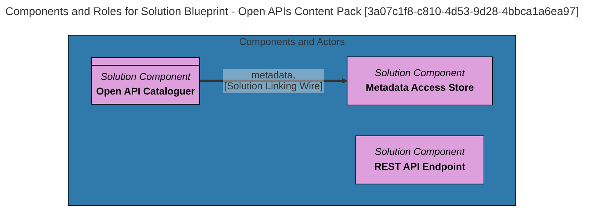

```mermaid
---
title: Components and Roles for Solution Blueprint - Open APIs Content Pack [3a07c1f8-c810-4d53-9d28-4bbca1a6ea97]
---
flowchart TD
%%{init: {"flowchart": {"htmlLabels": false}} }%%

subgraph 1 [Components and Actors]
2@{ shape: rect, label: "*Solution Component*
**Metadata Access Store**"}
3@{ shape: rect, label: "*Solution Component*
**REST API Endpoint**"}
4@{ shape: div-rect, label: "*Solution Component*
**Open API Cataloguer**"}
4==>|"metadata,
[Solution Linking Wire]"|2
end
style 1 color:#FFFFFF, fill:#3079ab, stroke:#000000
style 2 color:#000000, fill:#dda0dd, stroke:#000000
style 3 color:#000000, fill:#dda0dd, stroke:#000000
style 4 color:#000000, fill:#dda0dd, stroke:#000000
click 2 "https://egeria-project.org/concepts/metadata-access-store/" "Click for more documentation" _blank
click 3 "https://egeria-project.org/types/0/0026-Endpoints/" "Click for more documentation" _blank
click 4 "https://egeria-project.org/concepts/integration-connector/" "Click for more documentation" _blank
```
> Open APIs Content Pack: Solution blueprint supporting integration connectors extracting Open API specifications to Open APIs via swagger. (Extracted from 6.0-SNAPSHOT)
