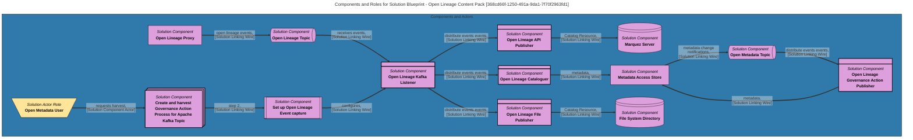

```mermaid
---
title: Components and Roles for Solution Blueprint - Open Lineage Content Pack [368cd66f-1250-491a-9da1-7f70f2963fd1]
---
flowchart TD
%%{init: {"flowchart": {"htmlLabels": false}} }%%

subgraph 1 [Components and Actors]
2@{ shape: processes, label: "*Solution Component*
**Create and harvest Governance Action Process for Apache Kafka Topic**"}
3@{ shape: div-rect, label: "*Solution Component*
**Open Lineage File Publisher**"}
4@{ shape: lin-cyl, label: "*Solution Component*
**Marquez Server**"}
5@{ shape: div-rect, label: "*Solution Component*
**Open Lineage Governance Action Publisher**"}
6@{ shape: das, label: "*Solution Component*
**Open Metadata Topic**"}
7@{ shape: div-rect, label: "*Solution Component*
**Open Lineage Kafka Listener**"}
8@{ shape: rect, label: "*Solution Component*
**Open Lineage Proxy**"}
9@{ shape: div-rect, label: "*Solution Component*
**Open Lineage Cataloguer**"}
10@{ shape: rect, label: "*Solution Component*
**Metadata Access Store**"}
11@{ shape: lin-cyl, label: "*Solution Component*
**File System Directory**"}
12@{ shape: div-rect, label: "*Solution Component*
**Open Lineage API Publisher**"}
13@{ shape: das, label: "*Solution Component*
**Open Lineage Topic**"}
14@{ shape: subproc, label: "*Solution Component*
**Set up Open Lineage Event capture**"}
15@{ shape: trap-t, label: "*Solution Actor Role*
**Open Metadata User**"}
15==>|"requests harvest,
[Solution Component Actor]"|2
2==>|"step 2,
[Solution Linking Wire]"|14
3==>|"Catalog Resource,
[Solution Linking Wire]"|11
7==>|"distribute events events,
[Solution Linking Wire]"|3
12==>|"Catalog Resource,
[Solution Linking Wire]"|4
5==>|"metadata,
[Solution Linking Wire]"|10
6==>|"distribute events events,
[Solution Linking Wire]"|5
10==>|"metadata change notifications,
[Solution Linking Wire]"|6
7==>|"distribute events events,
[Solution Linking Wire]"|12
13==>|"receives events,
[Solution Linking Wire]"|7
7==>|"distribute events events,
[Solution Linking Wire]"|9
14==>|"configures,
[Solution Linking Wire]"|7
8==>|"open lineage events,
[Solution Linking Wire]"|13
9==>|"metadata,
[Solution Linking Wire]"|10
end
style 11 color:#000000, fill:#dda0dd, stroke:#000000
style 12 color:#000000, fill:#dda0dd, stroke:#000000
style 13 color:#000000, fill:#dda0dd, stroke:#000000
style 14 color:#000000, fill:#dda0dd, stroke:#000000
style 15 color:#000000, fill:#FFE599, stroke:#000000
style 1 color:#FFFFFF, fill:#3079ab, stroke:#000000
style 2 color:#000000, fill:#dda0dd, stroke:#000000
style 3 color:#000000, fill:#dda0dd, stroke:#000000
style 4 color:#000000, fill:#dda0dd, stroke:#000000
style 5 color:#000000, fill:#dda0dd, stroke:#000000
style 6 color:#000000, fill:#dda0dd, stroke:#000000
style 7 color:#000000, fill:#dda0dd, stroke:#000000
style 8 color:#000000, fill:#dda0dd, stroke:#000000
style 9 color:#000000, fill:#dda0dd, stroke:#000000
style 10 color:#000000, fill:#dda0dd, stroke:#000000
click 11 "https://egeria-project.org/types/2/0220-Files-and-Folders/" "Click for more documentation" _blank
click 12 "https://egeria-project.org/concepts/integration-connector/" "Click for more documentation" _blank
click 13 "https://egeria-project.org/features/lineage-management/overview/#egerias-open-lineage-support" "Click for more documentation" _blank
click 14 "https://egeria-project.org/concepts/governance-action-type/" "Click for more documentation" _blank
click 2 "https://egeria-project.org/egeria-solutions/leveraging-open-lineage/overview/" "Click for more documentation" _blank
click 3 "https://egeria-project.org/concepts/integration-connector/" "Click for more documentation" _blank
click 4 "https://marquezproject.ai/" "Click for more documentation" _blank
click 5 "https://egeria-project.org/concepts/integration-connector/" "Click for more documentation" _blank
click 6 "https://egeria-project.org/concepts/open-metadata-topic-connector/" "Click for more documentation" _blank
click 7 "https://egeria-project.org/concepts/integration-connector/" "Click for more documentation" _blank
click 8 "https://egeria-project.org/features/lineage-management/overview/#egerias-open-lineage-support" "Click for more documentation" _blank
click 9 "https://egeria-project.org/concepts/integration-connector/" "Click for more documentation" _blank
click 10 "https://egeria-project.org/concepts/metadata-access-store/" "Click for more documentation" _blank
```
> Open Lineage Content Pack: Solution blueprint containing integration connectors for working with open lineage events. (Extracted from 6.0-SNAPSHOT)
