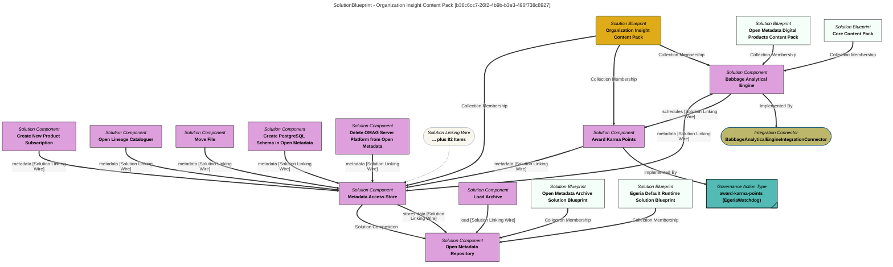

```mermaid
---
title: SolutionBlueprint - Organization Insight Content Pack [b36c6cc7-26f2-4b9b-b3e3-496f738c8927]
---
flowchart TD
%%{init: {"flowchart": {"htmlLabels": false}} }%%

1@{ shape: rounded, label: "*Solution Blueprint*
**Organization Insight Content Pack**"}
2@{ shape: rect, label: "*Solution Component*
**Metadata Access Store**"}
1==>|"Collection Membership"|2
3@{ shape: rect, label: "*Solution Component*
**Open Metadata Repository**"}
2==>|"Solution Composition"|3
4@{ shape: rect, label: "*Solution Component*
**Load Archive**"}
4==>|"load [Solution Linking Wire]"|3
2==>|"stores data [Solution Linking Wire]"|3
5@{ shape: rect, label: "*Solution Blueprint*
**Open Metadata Archive Solution Blueprint**"}
5==>|"Collection Membership"|3
6@{ shape: rect, label: "*Solution Blueprint*
**Egeria Default Runtime Solution Blueprint**"}
6==>|"Collection Membership"|3
7@{ shape: rect, label: "*Solution Component*
**Create New Product Subscription**"}
7==>|"metadata [Solution Linking Wire]"|2
8@{ shape: rect, label: "*Solution Component*
**Open Lineage Cataloguer**"}
8==>|"metadata [Solution Linking Wire]"|2
9@{ shape: rect, label: "*Solution Component*
**Move File**"}
9==>|"metadata [Solution Linking Wire]"|2
10@{ shape: rect, label: "*Solution Component*
**Babbage Analytical Engine**"}
10==>|"metadata [Solution Linking Wire]"|2
11@{ shape: rect, label: "*Solution Component*
**Create PostgreSQL Schema in Open Metadata**"}
11==>|"metadata [Solution Linking Wire]"|2
12@{ shape: rect, label: "*Solution Component*
**Delete OMAG Server Platform from Open Metadata**"}
12==>|"metadata [Solution Linking Wire]"|2
13@{ shape: stadium, label: "*Solution Linking Wire*
**... plus 82 Items**"}
13-.->2
14@{ shape: rect, label: "*Solution Component*
**Award Karma Points**"}
1==>|"Collection Membership"|14
10==>|"schedules [Solution Linking Wire]"|14
14==>|"metadata [Solution Linking Wire]"|2
15@{ shape: tag-rect, label: "*Governance Action Type*
**award-karma-points (EgeriaWatchdog)**"}
14==>|"Implemented By"|15
1==>|"Collection Membership"|10
16@{ shape: rect, label: "*Solution Blueprint*
**Open Metadata Digital Products Content Pack**"}
16==>|"Collection Membership"|10
17@{ shape: rect, label: "*Solution Blueprint*
**Core Content Pack**"}
17==>|"Collection Membership"|10
18@{ shape: stadium, label: "*Integration Connector*
**BabbageAnalyticalEngineIntegrationConnector**"}
10==>|"Implemented By"|18
style 11 color:#000000, fill:#dda0dd, stroke:#000000
style 12 color:#000000, fill:#dda0dd, stroke:#000000
style 13 color:#000000, fill:#F9F7ED, stroke:#b7c0c7
style 14 color:#000000, fill:#dda0dd, stroke:#000000
style 15 color:#000000, fill:#53bbb4, stroke:#000000
style 16 color:#000000, fill:#f5fffa, stroke:#000000
style 17 color:#000000, fill:#f5fffa, stroke:#000000
style 18 color:#000000, fill:#bdb76b, stroke:#004563
style 1 color:#000000, fill:#e0ab18, stroke:#004563
style 2 color:#000000, fill:#dda0dd, stroke:#000000
style 3 color:#000000, fill:#dda0dd, stroke:#000000
style 4 color:#000000, fill:#dda0dd, stroke:#000000
style 5 color:#000000, fill:#f5fffa, stroke:#000000
style 6 color:#000000, fill:#f5fffa, stroke:#000000
style 7 color:#000000, fill:#dda0dd, stroke:#000000
style 8 color:#000000, fill:#dda0dd, stroke:#000000
style 9 color:#000000, fill:#dda0dd, stroke:#000000
style 10 color:#000000, fill:#dda0dd, stroke:#000000
click 11 "https://egeria-project.org/concepts/governance-action-type/" "Click for more documentation" _blank
click 12 "https://egeria-project.org/concepts/governance-action-type/" "Click for more documentation" _blank
click 2 "https://egeria-project.org/concepts/metadata-access-store/" "Click for more documentation" _blank
click 3 "https://egeria-project.org/concepts/open-metadata-repository/" "Click for more documentation" _blank
click 14 "https://egeria-project.org/concepts/governance-action-type/" "Click for more documentation" _blank
click 4 "https://egeria-project.org/concepts/open-metadata-archive/" "Click for more documentation" _blank
click 7 "https://egeria-project.org/concepts/governance-action-type/" "Click for more documentation" _blank
click 8 "https://egeria-project.org/concepts/integration-connector/" "Click for more documentation" _blank
click 9 "https://egeria-project.org/concepts/governance-action-type/" "Click for more documentation" _blank
click 10 "https://egeria-project.org/concepts/integration-connector/" "Click for more documentation" _blank
```
> Organization Insight Content Pack: Solution blueprint describing the components that deliver organization insight to the open metadata ecosystem. (Extracted from 6.0-SNAPSHOT)
