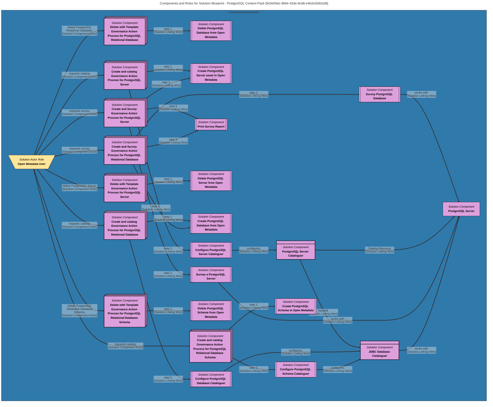

```mermaid
---
title: Components and Roles for Solution Blueprint - PostgreSQL Content Pack [9c0e55dc-96b4-42de-8cd8-e4b2e2b92a38]
---
flowchart TD
%%{init: {"flowchart": {"htmlLabels": false}} }%%

subgraph 1 [Components and Actors]
2@{ shape: subproc, label: "*Solution Component*
**Survey PostgreSQL Database**"}
3@{ shape: subproc, label: "*Solution Component*
**Delete PostgreSQL Database from Open Metadata**"}
4@{ shape: subproc, label: "*Solution Component*
**Create PostgreSQL Server asset in Open Metadata**"}
5@{ shape: processes, label: "*Solution Component*
**Create and catalog Governance Action Process for PostgreSQL Relational Database Schema**"}
6@{ shape: subproc, label: "*Solution Component*
**Print Survey Report**"}
7@{ shape: processes, label: "*Solution Component*
**Create and Survey Governance Action Process for PostgreSQL Server**"}
8@{ shape: subproc, label: "*Solution Component*
**Delete PostgreSQL Server from Open Metadata**"}
9@{ shape: subproc, label: "*Solution Component*
**Create PostgreSQL Database from Open Metadata**"}
10@{ shape: processes, label: "*Solution Component*
**Create and catalog Governance Action Process for PostgreSQL Relational Database**"}
11@{ shape: div-rect, label: "*Solution Component*
**PostgreSQL Server Cataloguer**"}
12@{ shape: subproc, label: "*Solution Component*
**Configure PostgreSQL Server Cataloguer**"}
13@{ shape: processes, label: "*Solution Component*
**Delete with Template Governance Action Process for PostgreSQL Relational Database Schema**"}
14@{ shape: subproc, label: "*Solution Component*
**Configure PostgreSQL Database Cataloguer**"}
15@{ shape: subproc, label: "*Solution Component*
**Delete PostgreSQL Schema from Open Metadata**"}
16@{ shape: processes, label: "*Solution Component*
**Create and catalog Governance Action Process for PostgreSQL Server**"}
17@{ shape: processes, label: "*Solution Component*
**Delete with Template Governance Action Process for PostgreSQL Server**"}
18@{ shape: processes, label: "*Solution Component*
**Delete with Template Governance Action Process for PostgreSQL Relational Database**"}
19@{ shape: subproc, label: "*Solution Component*
**Configure PostgreSQL Schema Cataloguer**"}
20@{ shape: subproc, label: "*Solution Component*
**Create PostgreSQL Schema in Open Metadata**"}
21@{ shape: subproc, label: "*Solution Component*
**Survey a PostgreSQL Server**"}
22@{ shape: rect, label: "*Solution Component*
**PostgreSQL Server**"}
23@{ shape: div-rect, label: "*Solution Component*
**JDBC Database Cataloguer**"}
24@{ shape: processes, label: "*Solution Component*
**Create and Survey Governance Action Process for PostgreSQL Relational Database**"}
24==>|"step 2,
[Solution Linking Wire]"|2
2==>|"works with,
[Solution Linking Wire]"|22
18==>|"step 1,
[Solution Linking Wire]"|3
16==>|"step 1,
[Solution Linking Wire]"|4
7==>|"step 1,
[Solution Linking Wire]"|4
25@{ shape: trap-t, label: "*Solution Actor Role*
**Open Metadata User**"}
25==>|"requests catalog,
[Solution Component Actor]"|5
5==>|"step 2,
[Solution Linking Wire]"|19
5==>|"step 1,
[Solution Linking Wire]"|20
7==>|"step 3,
[Solution Linking Wire]"|6
24==>|"step 3,
[Solution Linking Wire]"|6
25==>|"requests survey,
[Solution Component Actor]"|7
7==>|"step 2,
[Solution Linking Wire]"|21
17==>|"step 1,
[Solution Linking Wire]"|8
10==>|"step 1,
[Solution Linking Wire]"|9
24==>|"step 1,
[Solution Linking Wire]"|9
25==>|"requests catalog,
[Solution Component Actor]"|10
10==>|"step 2,
[Solution Linking Wire]"|14
12==>|"configures,
[Solution Linking Wire]"|11
11==>|"handoff,
[Solution Linking Wire]"|23
11==>|"Catalog Resource,
[Solution Linking Wire]"|22
16==>|"step 2,
[Solution Linking Wire]"|12
25==>|"delete PostgreSQL Relational Database Schema,
[Solution Component Actor]"|13
13==>|"step 1,
[Solution Linking Wire]"|15
14==>|"configures,
[Solution Linking Wire]"|23
25==>|"requests catalog,
[Solution Component Actor]"|16
25==>|"delete PostgreSQL Server,
[Solution Component Actor]"|17
25==>|"delete PostgreSQL Relational Database,
[Solution Component Actor]"|18
19==>|"configures,
[Solution Linking Wire]"|23
21==>|"works with,
[Solution Linking Wire]"|22
23==>|"works with,
[Solution Linking Wire]"|22
25==>|"requests survey,
[Solution Component Actor]"|24
end
style 22 color:#000000, fill:#dda0dd, stroke:#000000
style 23 color:#000000, fill:#dda0dd, stroke:#000000
style 24 color:#000000, fill:#dda0dd, stroke:#000000
style 25 color:#000000, fill:#FFE599, stroke:#000000
style 10 color:#000000, fill:#dda0dd, stroke:#000000
style 11 color:#000000, fill:#dda0dd, stroke:#000000
style 12 color:#000000, fill:#dda0dd, stroke:#000000
style 13 color:#000000, fill:#dda0dd, stroke:#000000
style 14 color:#000000, fill:#dda0dd, stroke:#000000
style 15 color:#000000, fill:#dda0dd, stroke:#000000
style 16 color:#000000, fill:#dda0dd, stroke:#000000
style 17 color:#000000, fill:#dda0dd, stroke:#000000
style 18 color:#000000, fill:#dda0dd, stroke:#000000
style 19 color:#000000, fill:#dda0dd, stroke:#000000
style 1 color:#FFFFFF, fill:#3079ab, stroke:#000000
style 2 color:#000000, fill:#dda0dd, stroke:#000000
style 3 color:#000000, fill:#dda0dd, stroke:#000000
style 4 color:#000000, fill:#dda0dd, stroke:#000000
style 5 color:#000000, fill:#dda0dd, stroke:#000000
style 6 color:#000000, fill:#dda0dd, stroke:#000000
style 7 color:#000000, fill:#dda0dd, stroke:#000000
style 8 color:#000000, fill:#dda0dd, stroke:#000000
style 9 color:#000000, fill:#dda0dd, stroke:#000000
style 20 color:#000000, fill:#dda0dd, stroke:#000000
style 21 color:#000000, fill:#dda0dd, stroke:#000000
click 11 "https://egeria-project.org/concepts/integration-connector/" "Click for more documentation" _blank
click 22 "https://www.postgresql.org/" "Click for more documentation" _blank
click 12 "https://egeria-project.org/concepts/governance-action-type/" "Click for more documentation" _blank
click 23 "https://egeria-project.org/concepts/integration-connector/" "Click for more documentation" _blank
click 13 "https://egeria-project.org/egeria-solutions/leveraging-postgres/overview/" "Click for more documentation" _blank
click 24 "https://egeria-project.org/egeria-solutions/leveraging-postgres/overview/" "Click for more documentation" _blank
click 14 "https://egeria-project.org/concepts/governance-action-type/" "Click for more documentation" _blank
click 15 "https://egeria-project.org/concepts/governance-action-type/" "Click for more documentation" _blank
click 16 "https://egeria-project.org/egeria-solutions/leveraging-postgres/overview/" "Click for more documentation" _blank
click 17 "https://egeria-project.org/egeria-solutions/leveraging-postgres/overview/" "Click for more documentation" _blank
click 18 "https://egeria-project.org/egeria-solutions/leveraging-postgres/overview/" "Click for more documentation" _blank
click 19 "https://egeria-project.org/concepts/governance-action-type/" "Click for more documentation" _blank
click 2 "https://egeria-project.org/concepts/governance-action-type/" "Click for more documentation" _blank
click 3 "https://egeria-project.org/concepts/governance-action-type/" "Click for more documentation" _blank
click 4 "https://egeria-project.org/concepts/governance-action-type/" "Click for more documentation" _blank
click 5 "https://egeria-project.org/egeria-solutions/leveraging-postgres/overview/" "Click for more documentation" _blank
click 6 "https://egeria-project.org/concepts/governance-action-type/" "Click for more documentation" _blank
click 7 "https://egeria-project.org/egeria-solutions/leveraging-postgres/overview/" "Click for more documentation" _blank
click 8 "https://egeria-project.org/concepts/governance-action-type/" "Click for more documentation" _blank
click 9 "https://egeria-project.org/concepts/governance-action-type/" "Click for more documentation" _blank
click 20 "https://egeria-project.org/concepts/governance-action-type/" "Click for more documentation" _blank
click 10 "https://egeria-project.org/egeria-solutions/leveraging-postgres/overview/" "Click for more documentation" _blank
click 21 "https://egeria-project.org/concepts/governance-action-type/" "Click for more documentation" _blank
```
> PostgreSQL Content Pack: Solution blueprint supporting integration connectors connecting to PostgreSQL Servers. (Extracted from 6.0-SNAPSHOT)
