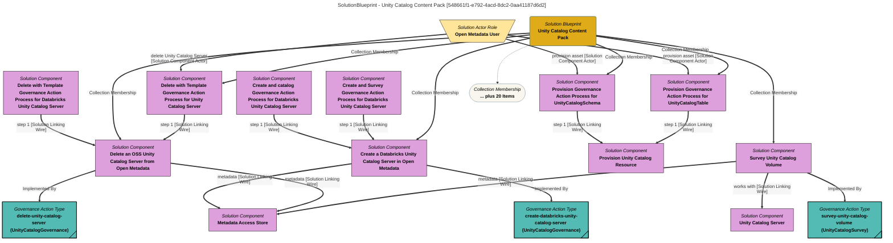

```mermaid
---
title: SolutionBlueprint - Unity Catalog Content Pack [548661f1-e792-4acd-8dc2-0aa41187d6d2]
---
flowchart TD
%%{init: {"flowchart": {"htmlLabels": false}} }%%

1@{ shape: rounded, label: "*Solution Blueprint*
**Unity Catalog Content Pack**"}
2@{ shape: rect, label: "*Solution Component*
**Delete with Template Governance Action Process for Unity Catalog Server**"}
1==>|"Collection Membership"|2
3@{ shape: trap-t, label: "*Solution Actor Role*
**Open Metadata User**"}
3==>|"delete Unity Catalog Server [Solution Component Actor]"|2
4@{ shape: rect, label: "*Solution Component*
**Delete an OSS Unity Catalog Server from Open Metadata**"}
2==>|"step 1 [Solution Linking Wire]"|4
5@{ shape: rect, label: "*Solution Component*
**Survey Unity Catalog Volume**"}
1==>|"Collection Membership"|5
6@{ shape: rect, label: "*Solution Component*
**Unity Catalog Server**"}
5==>|"works with [Solution Linking Wire]"|6
7@{ shape: rect, label: "*Solution Component*
**Metadata Access Store**"}
5==>|"metadata [Solution Linking Wire]"|7
8@{ shape: tag-rect, label: "*Governance Action Type*
**survey-unity-catalog-volume (UnityCatalogSurvey)**"}
5==>|"Implemented By"|8
9@{ shape: rect, label: "*Solution Component*
**Provision Governance Action Process for UnityCatalogTable**"}
1==>|"Collection Membership"|9
3==>|"provision asset [Solution Component Actor]"|9
10@{ shape: rect, label: "*Solution Component*
**Provision Unity Catalog Resource**"}
9==>|"step 1 [Solution Linking Wire]"|10
11@{ shape: rect, label: "*Solution Component*
**Provision Governance Action Process for UnityCatalogSchema**"}
1==>|"Collection Membership"|11
3==>|"provision asset [Solution Component Actor]"|11
11==>|"step 1 [Solution Linking Wire]"|10
1==>|"Collection Membership"|4
12@{ shape: rect, label: "*Solution Component*
**Delete with Template Governance Action Process for Databricks Unity Catalog Server**"}
12==>|"step 1 [Solution Linking Wire]"|4
4==>|"metadata [Solution Linking Wire]"|7
13@{ shape: tag-rect, label: "*Governance Action Type*
**delete-unity-catalog-server (UnityCatalogGovernance)**"}
4==>|"Implemented By"|13
14@{ shape: rect, label: "*Solution Component*
**Create a Databricks Unity Catalog Server in Open Metadata**"}
1==>|"Collection Membership"|14
15@{ shape: rect, label: "*Solution Component*
**Create and Survey Governance Action Process for Databricks Unity Catalog Server**"}
15==>|"step 1 [Solution Linking Wire]"|14
14==>|"metadata [Solution Linking Wire]"|7
16@{ shape: rect, label: "*Solution Component*
**Create and catalog Governance Action Process for Databricks Unity Catalog Server**"}
16==>|"step 1 [Solution Linking Wire]"|14
17@{ shape: tag-rect, label: "*Governance Action Type*
**create-databricks-unity-catalog-server (UnityCatalogGovernance)**"}
14==>|"Implemented By"|17
18@{ shape: stadium, label: "*Collection Membership*
**... plus 20 Items**"}
1-.->18
style 11 color:#000000, fill:#dda0dd, stroke:#000000
style 12 color:#000000, fill:#dda0dd, stroke:#000000
style 13 color:#000000, fill:#53bbb4, stroke:#000000
style 14 color:#000000, fill:#dda0dd, stroke:#000000
style 15 color:#000000, fill:#dda0dd, stroke:#000000
style 16 color:#000000, fill:#dda0dd, stroke:#000000
style 17 color:#000000, fill:#53bbb4, stroke:#000000
style 18 color:#000000, fill:#F9F7ED, stroke:#b7c0c7
style 1 color:#000000, fill:#e0ab18, stroke:#004563
style 2 color:#000000, fill:#dda0dd, stroke:#000000
style 3 color:#000000, fill:#FFE599, stroke:#000000
style 4 color:#000000, fill:#dda0dd, stroke:#000000
style 5 color:#000000, fill:#dda0dd, stroke:#000000
style 6 color:#000000, fill:#dda0dd, stroke:#000000
style 7 color:#000000, fill:#dda0dd, stroke:#000000
style 8 color:#000000, fill:#53bbb4, stroke:#000000
style 9 color:#000000, fill:#dda0dd, stroke:#000000
style 10 color:#000000, fill:#dda0dd, stroke:#000000
click 11 "https://egeria-project.org/egeria-solutions/leveraging-unity-catalog/overview/" "Click for more documentation" _blank
click 12 "https://egeria-project.org/egeria-solutions/leveraging-unity-catalog/overview/" "Click for more documentation" _blank
click 2 "https://egeria-project.org/egeria-solutions/leveraging-unity-catalog/overview/" "Click for more documentation" _blank
click 14 "https://egeria-project.org/concepts/governance-action-type/" "Click for more documentation" _blank
click 4 "https://egeria-project.org/concepts/governance-action-type/" "Click for more documentation" _blank
click 15 "https://egeria-project.org/egeria-solutions/leveraging-unity-catalog/overview/" "Click for more documentation" _blank
click 5 "https://egeria-project.org/concepts/governance-action-type/" "Click for more documentation" _blank
click 16 "https://egeria-project.org/egeria-solutions/leveraging-unity-catalog/overview/" "Click for more documentation" _blank
click 6 "https://github.com/unitycatalog/unitycatalog" "Click for more documentation" _blank
click 7 "https://egeria-project.org/concepts/metadata-access-store/" "Click for more documentation" _blank
click 9 "https://egeria-project.org/egeria-solutions/leveraging-unity-catalog/overview/" "Click for more documentation" _blank
click 10 "https://egeria-project.org/concepts/governance-action-type/" "Click for more documentation" _blank
```
> Unity Catalog Content Pack: Solution blueprint supporting the exchange of metadata between the open metadata ecosystem and Unity Catalog (UC). (Extracted from 6.0-SNAPSHOT)
