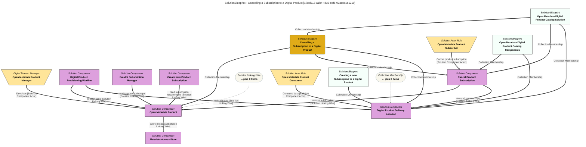

```mermaid
---
title: SolutionBlueprint - Cancelling a Subscription to a Digital Product [1f3bd116-a1b4-4d35-8bf5-03ac8d1e1210]
---
flowchart TD
%%{init: {"flowchart": {"htmlLabels": false}} }%%

1@{ shape: rounded, label: "*Solution Blueprint*
**Cancelling a Subscription to a Digital Product**"}
2@{ shape: rect, label: "*Solution Blueprint*
**Open Metadata Digital Product Catalog Solution**"}
2==>|"Collection Membership"|1
3@{ shape: rect, label: "*Solution Component*
**Open Metadata Product**"}
1==>|"Collection Membership"|3
4@{ shape: trap-t, label: "*Digital Product Manager*
**Open Metadata Product Manager**"}
4==>|"Develops [Solution Component Actor]"|3
5@{ shape: rect, label: "*Solution Component*
**Metadata Access Store**"}
3==>|"query metadata [Solution Linking Wire]"|5
6@{ shape: rect, label: "*Solution Component*
**Digital Product Provisioning Pipeline**"}
6==>|"retrieve data [Solution Linking Wire]"|3
7@{ shape: rect, label: "*Solution Component*
**Baudot Subscription Manager**"}
7==>|"monitor product changes [Solution Linking Wire]"|3
8@{ shape: rect, label: "*Solution Component*
**Create New Product Subscription**"}
8==>|"read subscription requirements [Solution Linking Wire]"|3
9@{ shape: rect, label: "*Solution Component*
**Cancel Product Subscription**"}
9==>|"remove subscription [Solution Linking Wire]"|3
10@{ shape: stadium, label: "*Solution Linking Wire*
**... plus 8 Items**"}
10-.->3
1==>|"Collection Membership"|9
11@{ shape: trap-t, label: "*Solution Actor Role*
**Open Metadata Product Subscriber**"}
11==>|"Cancel product subscription [Solution Component Actor]"|9
12@{ shape: rect, label: "*Solution Component*
**Digital Product Delivery Location**"}
9==>|"(maybe) remove copy [Solution Linking Wire]"|12
13@{ shape: rect, label: "*Solution Blueprint*
**Open Metadata Digital Product Catalog Components**"}
13==>|"Collection Membership"|9
2==>|"Collection Membership"|9
1==>|"Collection Membership"|12
14@{ shape: trap-t, label: "*Solution Actor Role*
**Open Metadata Product Consumer**"}
14==>|"Consume data [Solution Component Actor]"|12
6==>|"maintain data [Solution Linking Wire]"|12
15@{ shape: rect, label: "*Solution Blueprint*
**Creating a new Subscription to a Digital Product**"}
15==>|"Collection Membership"|12
2==>|"Collection Membership"|12
13==>|"Collection Membership"|12
16@{ shape: stadium, label: "*Collection Membership*
**... plus 2 Items**"}
16-.->12
style 11 color:#000000, fill:#FFE599, stroke:#000000
style 12 color:#000000, fill:#dda0dd, stroke:#000000
style 13 color:#000000, fill:#f5fffa, stroke:#000000
style 14 color:#000000, fill:#FFE599, stroke:#000000
style 15 color:#000000, fill:#f5fffa, stroke:#000000
style 16 color:#000000, fill:#F9F7ED, stroke:#b7c0c7
style 1 color:#000000, fill:#e0ab18, stroke:#004563
style 2 color:#000000, fill:#f5fffa, stroke:#000000
style 3 color:#000000, fill:#dda0dd, stroke:#000000
style 4 color:#000000, fill:#FFE599, stroke:#000000
style 5 color:#000000, fill:#dda0dd, stroke:#000000
style 6 color:#000000, fill:#dda0dd, stroke:#000000
style 7 color:#000000, fill:#dda0dd, stroke:#000000
style 8 color:#000000, fill:#dda0dd, stroke:#000000
style 9 color:#000000, fill:#dda0dd, stroke:#000000
style 10 color:#000000, fill:#F9F7ED, stroke:#b7c0c7
```
> Cancelling a Subscription to a Digital Product: Description of the processing used to cancel a subscription to an Open Metadata Digital Product. (Extracted from 6.0-SNAPSHOT)
