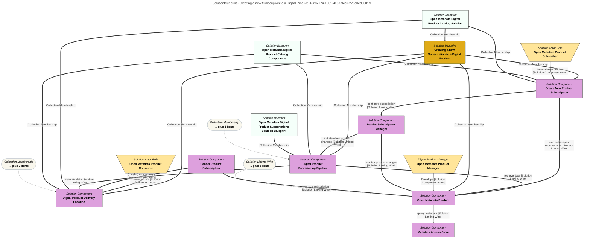

```mermaid
---
title: SolutionBlueprint - Creating a new Subscription to a Digital Product [45287174-1031-4e9d-9cc6-276e0ed33019]
---
flowchart TD
%%{init: {"flowchart": {"htmlLabels": false}} }%%

1@{ shape: rounded, label: "*Solution Blueprint*
**Creating a new Subscription to a Digital Product**"}
2@{ shape: rect, label: "*Solution Blueprint*
**Open Metadata Digital Product Catalog Solution**"}
2==>|"Collection Membership"|1
3@{ shape: rect, label: "*Solution Component*
**Digital Product Delivery Location**"}
1==>|"Collection Membership"|3
4@{ shape: trap-t, label: "*Solution Actor Role*
**Open Metadata Product Consumer**"}
4==>|"Consume data [Solution Component Actor]"|3
5@{ shape: rect, label: "*Solution Component*
**Cancel Product Subscription**"}
5==>|"(maybe) remove copy [Solution Linking Wire]"|3
6@{ shape: rect, label: "*Solution Component*
**Digital Product Provisioning Pipeline**"}
6==>|"maintain data [Solution Linking Wire]"|3
2==>|"Collection Membership"|3
7@{ shape: rect, label: "*Solution Blueprint*
**Open Metadata Digital Product Catalog Components**"}
7==>|"Collection Membership"|3
8@{ shape: stadium, label: "*Collection Membership*
**... plus 2 Items**"}
8-.->3
1==>|"Collection Membership"|6
9@{ shape: rect, label: "*Solution Component*
**Open Metadata Product**"}
6==>|"retrieve data [Solution Linking Wire]"|9
10@{ shape: rect, label: "*Solution Component*
**Baudot Subscription Manager**"}
10==>|"initiate when product changes [Solution Linking Wire]"|6
7==>|"Collection Membership"|6
11@{ shape: rect, label: "*Solution Blueprint*
**Open Metadata Digital Product Subscriptions Solution Blueprint**"}
11==>|"Collection Membership"|6
12@{ shape: stadium, label: "*Collection Membership*
**... plus 1 Items**"}
12-.->6
13@{ shape: rect, label: "*Solution Component*
**Create New Product Subscription**"}
1==>|"Collection Membership"|13
14@{ shape: trap-t, label: "*Solution Actor Role*
**Open Metadata Product Subscriber**"}
14==>|"Subscribe to product [Solution Component Actor]"|13
13==>|"read subscription requirements [Solution Linking Wire]"|9
13==>|"configure subscription [Solution Linking Wire]"|10
7==>|"Collection Membership"|13
2==>|"Collection Membership"|13
1==>|"Collection Membership"|9
15@{ shape: trap-t, label: "*Digital Product Manager*
**Open Metadata Product Manager**"}
15==>|"Develops [Solution Component Actor]"|9
16@{ shape: rect, label: "*Solution Component*
**Metadata Access Store**"}
9==>|"query metadata [Solution Linking Wire]"|16
10==>|"monitor product changes [Solution Linking Wire]"|9
5==>|"remove subscription [Solution Linking Wire]"|9
17@{ shape: stadium, label: "*Solution Linking Wire*
**... plus 8 Items**"}
17-.->9
style 11 color:#000000, fill:#f5fffa, stroke:#000000
style 12 color:#000000, fill:#F9F7ED, stroke:#b7c0c7
style 13 color:#000000, fill:#dda0dd, stroke:#000000
style 14 color:#000000, fill:#FFE599, stroke:#000000
style 15 color:#000000, fill:#FFE599, stroke:#000000
style 16 color:#000000, fill:#dda0dd, stroke:#000000
style 17 color:#000000, fill:#F9F7ED, stroke:#b7c0c7
style 1 color:#000000, fill:#e0ab18, stroke:#004563
style 2 color:#000000, fill:#f5fffa, stroke:#000000
style 3 color:#000000, fill:#dda0dd, stroke:#000000
style 4 color:#000000, fill:#FFE599, stroke:#000000
style 5 color:#000000, fill:#dda0dd, stroke:#000000
style 6 color:#000000, fill:#dda0dd, stroke:#000000
style 7 color:#000000, fill:#f5fffa, stroke:#000000
style 8 color:#000000, fill:#F9F7ED, stroke:#b7c0c7
style 9 color:#000000, fill:#dda0dd, stroke:#000000
style 10 color:#000000, fill:#dda0dd, stroke:#000000
```
> Creating a new Subscription to a Digital Product: Description of the processing when a consumer creates a new subscription to an Open Metadata Digital Product. (Extracted from 6.0-SNAPSHOT)
