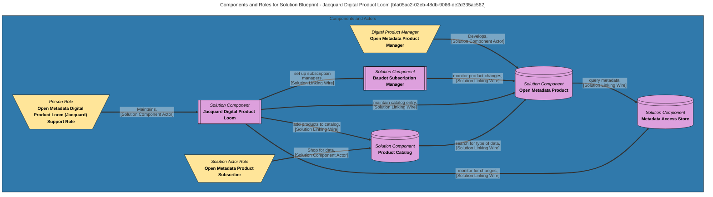

> Jacquard Digital Product Loom: Description of the processing used to create and manage the digital products derived from open metadata in the Open Metadata Digital Product Catalog. (Extracted from 6.0-SNAPSHOT)
