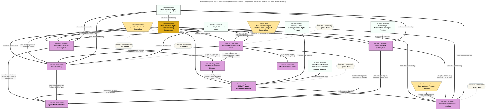

```mermaid
---
title: SolutionBlueprint - Open Metadata Digital Product Catalog Components [516950e8-ed42-4288-808c-dcd661b43bf2]
---
flowchart TD
%%{init: {"flowchart": {"htmlLabels": false}} }%%

1@{ shape: rounded, label: "*Solution Blueprint*
**Open Metadata Digital Product Catalog Components**"}
2@{ shape: rect, label: "*Solution Blueprint*
**Open Metadata Digital Product Catalog Solution**"}
2==>|"Collection Membership"|1
3@{ shape: rect, label: "*Solution Component*
**Create New Product Subscription**"}
1==>|"Collection Membership"|3
4@{ shape: trap-t, label: "*Solution Actor Role*
**Open Metadata Product Subscriber**"}
4==>|"Subscribe to product [Solution Component Actor]"|3
5@{ shape: rect, label: "*Solution Component*
**Open Metadata Product**"}
3==>|"read subscription requirements [Solution Linking Wire]"|5
6@{ shape: rect, label: "*Solution Component*
**Baudot Subscription Manager**"}
3==>|"configure subscription [Solution Linking Wire]"|6
7@{ shape: rect, label: "*Solution Blueprint*
**Creating a new Subscription to a Digital Product**"}
7==>|"Collection Membership"|3
2==>|"Collection Membership"|3
8@{ shape: rect, label: "*Solution Component*
**Digital Product Provisioning Pipeline**"}
1==>|"Collection Membership"|8
8==>|"retrieve data [Solution Linking Wire]"|5
9@{ shape: rect, label: "*Solution Component*
**Digital Product Delivery Location**"}
8==>|"maintain data [Solution Linking Wire]"|9
6==>|"initiate when product changes [Solution Linking Wire]"|8
7==>|"Collection Membership"|8
10@{ shape: rect, label: "*Solution Blueprint*
**Open Metadata Digital Product Subscriptions Solution Blueprint**"}
10==>|"Collection Membership"|8
11@{ shape: stadium, label: "*Collection Membership*
**... plus 1 Items**"}
11-.->8
12@{ shape: rect, label: "*Solution Component*
**Product Catalog**"}
1==>|"Collection Membership"|12
4==>|"Shop for data [Solution Component Actor]"|12
13@{ shape: rect, label: "*Solution Component*
**Jacquard Digital Product Loom**"}
13==>|"add products to catalog [Solution Linking Wire]"|12
12==>|"search for type of data [Solution Linking Wire]"|5
2==>|"Collection Membership"|12
14@{ shape: rect, label: "*Solution Blueprint*
**Jacquard Digital Product Loom**"}
14==>|"Collection Membership"|12
15@{ shape: stadium, label: "*Collection Membership*
**... plus 1 Items**"}
15-.->12
1==>|"Collection Membership"|9
16@{ shape: trap-t, label: "*Solution Actor Role*
**Open Metadata Product Consumer**"}
16==>|"Consume data [Solution Component Actor]"|9
17@{ shape: rect, label: "*Solution Component*
**Cancel Product Subscription**"}
17==>|"(maybe) remove copy [Solution Linking Wire]"|9
7==>|"Collection Membership"|9
2==>|"Collection Membership"|9
18@{ shape: stadium, label: "*Collection Membership*
**... plus 2 Items**"}
18-.->9
1==>|"Collection Membership"|13
19@{ shape: trap-t, label: "*Person Role*
**Open Metadata Digital Product Loom (Jacquard) Support Role**"}
19==>|"Maintains [Solution Component Actor]"|13
20@{ shape: rect, label: "*Solution Component*
**Metadata Access Store**"}
13==>|"monitor for changes [Solution Linking Wire]"|20
13==>|"set up subscription managers [Solution Linking Wire]"|6
13==>|"maintain catalog entry [Solution Linking Wire]"|5
14==>|"Collection Membership"|13
21@{ shape: stadium, label: "*Collection Membership*
**... plus 2 Items**"}
21-.->13
1==>|"Collection Membership"|17
4==>|"Cancel product subscription [Solution Component Actor]"|17
17==>|"remove subscription [Solution Linking Wire]"|5
22@{ shape: rect, label: "*Solution Blueprint*
**Cancelling a Subscription to a Digital Product**"}
22==>|"Collection Membership"|17
2==>|"Collection Membership"|17
23@{ shape: stadium, label: "*Collection Membership*
**... plus 2 Items**"}
1-.->23
style 11 color:#000000, fill:#F9F7ED, stroke:#b7c0c7
style 22 color:#000000, fill:#f5fffa, stroke:#000000
style 12 color:#000000, fill:#dda0dd, stroke:#000000
style 23 color:#000000, fill:#F9F7ED, stroke:#b7c0c7
style 13 color:#000000, fill:#dda0dd, stroke:#000000
style 14 color:#000000, fill:#f5fffa, stroke:#000000
style 15 color:#000000, fill:#F9F7ED, stroke:#b7c0c7
style 16 color:#000000, fill:#FFE599, stroke:#000000
style 17 color:#000000, fill:#dda0dd, stroke:#000000
style 18 color:#000000, fill:#F9F7ED, stroke:#b7c0c7
style 19 color:#000000, fill:#FFE599, stroke:#000000
style 1 color:#000000, fill:#e0ab18, stroke:#004563
style 2 color:#000000, fill:#f5fffa, stroke:#000000
style 3 color:#000000, fill:#dda0dd, stroke:#000000
style 4 color:#000000, fill:#FFE599, stroke:#000000
style 5 color:#000000, fill:#dda0dd, stroke:#000000
style 6 color:#000000, fill:#dda0dd, stroke:#000000
style 7 color:#000000, fill:#f5fffa, stroke:#000000
style 8 color:#000000, fill:#dda0dd, stroke:#000000
style 9 color:#000000, fill:#dda0dd, stroke:#000000
style 20 color:#000000, fill:#dda0dd, stroke:#000000
style 10 color:#000000, fill:#f5fffa, stroke:#000000
style 21 color:#000000, fill:#F9F7ED, stroke:#b7c0c7
```
> Open Metadata Digital Product Catalog Components: Description of the processing used to create and manage the digital products derived from open metadata. (Extracted from 6.0-SNAPSHOT)
