```mermaid
---
title: SolutionBlueprint - Open Metadata Digital Product Catalog Solution [c508ec4d-b3a9-4d2c-a032-301c8e5ce037]
---
flowchart TD
%%{init: {"flowchart": {"htmlLabels": false}} }%%

1@{ shape: rounded, label: "*Solution Blueprint*
**Open Metadata Digital Product Catalog Solution**"}
2@{ shape: rect, label: "*Solution Component*
**Digital Product Community**"}
1==>|"Collection Membership"|2
3@{ shape: trap-t, label: "*Person Role*
**Open Metadata Digital Product Loom (Jacquard) Support Role**"}
3==>|"Jacquard and subscription manager discussions [Solution Component Actor]"|2
4@{ shape: trap-t, label: "*Digital Product Manager*
**Open Metadata Product Manager**"}
4==>|"Product discussions [Solution Component Actor]"|2
5@{ shape: trap-t, label: "*Solution Actor Role*
**Open Metadata Digital Product Community Member**"}
5==>|"Member of [Solution Component Actor]"|2
6@{ shape: rect, label: "*Solution Component*
**Baudot Subscription Manager**"}
6==>|"notify when product changes [Solution Linking Wire]"|2
7@{ shape: rect, label: "*Solution Blueprint*
**Open Metadata Digital Product Community Solution Blueprint**"}
7==>|"Collection Membership"|2
8@{ shape: rect, label: "*Solution Component*
**Product Catalog**"}
1==>|"Collection Membership"|8
9@{ shape: trap-t, label: "*Solution Actor Role*
**Open Metadata Product Subscriber**"}
9==>|"Shop for data [Solution Component Actor]"|8
10@{ shape: rect, label: "*Solution Component*
**Jacquard Digital Product Loom**"}
10==>|"add products to catalog [Solution Linking Wire]"|8
11@{ shape: rect, label: "*Solution Component*
**Open Metadata Product**"}
8==>|"search for type of data [Solution Linking Wire]"|11
12@{ shape: rect, label: "*Solution Blueprint*
**Open Metadata Digital Product Catalog Components**"}
12==>|"Collection Membership"|8
13@{ shape: rect, label: "*Solution Blueprint*
**Jacquard Digital Product Loom**"}
13==>|"Collection Membership"|8
14@{ shape: stadium, label: "*Collection Membership*
**... plus 1 Items**"}
14-.->8
1==>|"Collection Membership"|10
3==>|"Maintains [Solution Component Actor]"|10
15@{ shape: rect, label: "*Solution Component*
**Metadata Access Store**"}
10==>|"monitor for changes [Solution Linking Wire]"|15
10==>|"set up subscription managers [Solution Linking Wire]"|6
10==>|"maintain catalog entry [Solution Linking Wire]"|11
13==>|"Collection Membership"|10
16@{ shape: stadium, label: "*Collection Membership*
**... plus 2 Items**"}
16-.->10
17@{ shape: rect, label: "*Solution Component*
**Digital Product Provisioning Pipeline**"}
1==>|"Collection Membership"|17
17==>|"retrieve data [Solution Linking Wire]"|11
18@{ shape: rect, label: "*Solution Component*
**Digital Product Delivery Location**"}
17==>|"maintain data [Solution Linking Wire]"|18
6==>|"initiate when product changes [Solution Linking Wire]"|17
12==>|"Collection Membership"|17
19@{ shape: rect, label: "*Solution Blueprint*
**Creating a new Subscription to a Digital Product**"}
19==>|"Collection Membership"|17
20@{ shape: rect, label: "*Solution Blueprint*
**Open Metadata Digital Product Subscriptions Solution Blueprint**"}
20==>|"Collection Membership"|17
21@{ shape: stadium, label: "*Collection Membership*
**... plus 1 Items**"}
21-.->17
1==>|"Collection Membership"|13
13==>|"Collection Membership"|11
13==>|"Collection Membership"|6
13==>|"Collection Membership"|15
22@{ shape: rect, label: "*Solution Component*
**Create New Product Subscription**"}
1==>|"Collection Membership"|22
9==>|"Subscribe to product [Solution Component Actor]"|22
22==>|"read subscription requirements [Solution Linking Wire]"|11
22==>|"configure subscription [Solution Linking Wire]"|6
12==>|"Collection Membership"|22
19==>|"Collection Membership"|22
23@{ shape: stadium, label: "*Collection Membership*
**... plus 11 Items**"}
1-.->23
24@{ shape: rect, label: "*Digital Product Catalog*
**Open Metadata Digital Product Catalog**"}
24==>|"Solution Design"|1
style 11 color:#000000, fill:#dda0dd, stroke:#000000
style 22 color:#000000, fill:#dda0dd, stroke:#000000
style 12 color:#000000, fill:#f5fffa, stroke:#000000
style 23 color:#000000, fill:#F9F7ED, stroke:#b7c0c7
style 13 color:#000000, fill:#f5fffa, stroke:#000000
style 24 color:#000000, fill:#f5fffa, stroke:#000000
style 14 color:#000000, fill:#F9F7ED, stroke:#b7c0c7
style 15 color:#000000, fill:#dda0dd, stroke:#000000
style 16 color:#000000, fill:#F9F7ED, stroke:#b7c0c7
style 17 color:#000000, fill:#dda0dd, stroke:#000000
style 18 color:#000000, fill:#dda0dd, stroke:#000000
style 19 color:#000000, fill:#f5fffa, stroke:#000000
style 1 color:#000000, fill:#e0ab18, stroke:#004563
style 2 color:#000000, fill:#dda0dd, stroke:#000000
style 3 color:#000000, fill:#FFE599, stroke:#000000
style 4 color:#000000, fill:#FFE599, stroke:#000000
style 5 color:#000000, fill:#FFE599, stroke:#000000
style 6 color:#000000, fill:#dda0dd, stroke:#000000
style 7 color:#000000, fill:#f5fffa, stroke:#000000
style 8 color:#000000, fill:#dda0dd, stroke:#000000
style 9 color:#000000, fill:#FFE599, stroke:#000000
style 20 color:#000000, fill:#f5fffa, stroke:#000000
style 10 color:#000000, fill:#dda0dd, stroke:#000000
style 21 color:#000000, fill:#F9F7ED, stroke:#b7c0c7
```

> Open Metadata Digital Product Catalog Solution: The Open Metadata Digital Product Catalog enables the distribution of reference data and context for AI processing from the open metadata ecosystem.  The Product Catalog makes it easy to locate the right data and the subscription manager delivers the data to wherever it needs to be.  Behind the scenes, lineage and statistics on the data consumption are automatically maintained, demonstrating the value chains associated with the data. (Extracted from 6.0-SNAPSHOT)
