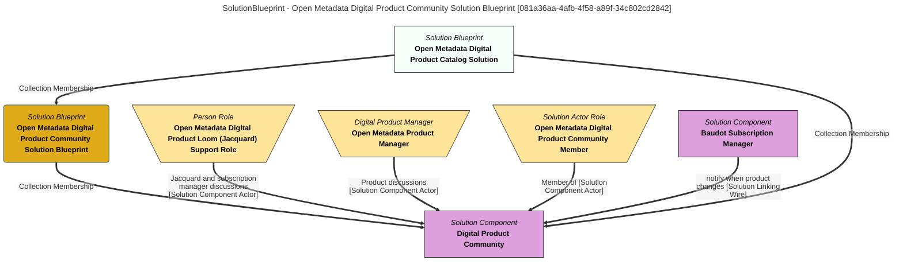

```mermaid
---
title: SolutionBlueprint - Open Metadata Digital Product Community Solution Blueprint [081a36aa-4afb-4f58-a89f-34c802cd2842]
---
flowchart TD
%%{init: {"flowchart": {"htmlLabels": false}} }%%

1@{ shape: rounded, label: "*Solution Blueprint*
**Open Metadata Digital Product Community Solution Blueprint**"}
2@{ shape: rect, label: "*Solution Blueprint*
**Open Metadata Digital Product Catalog Solution**"}
2==>|"Collection Membership"|1
3@{ shape: rect, label: "*Solution Component*
**Digital Product Community**"}
1==>|"Collection Membership"|3
4@{ shape: trap-t, label: "*Person Role*
**Open Metadata Digital Product Loom (Jacquard) Support Role**"}
4==>|"Jacquard and subscription manager discussions [Solution Component Actor]"|3
5@{ shape: trap-t, label: "*Digital Product Manager*
**Open Metadata Product Manager**"}
5==>|"Product discussions [Solution Component Actor]"|3
6@{ shape: trap-t, label: "*Solution Actor Role*
**Open Metadata Digital Product Community Member**"}
6==>|"Member of [Solution Component Actor]"|3
7@{ shape: rect, label: "*Solution Component*
**Baudot Subscription Manager**"}
7==>|"notify when product changes [Solution Linking Wire]"|3
2==>|"Collection Membership"|3
style 1 color:#000000, fill:#e0ab18, stroke:#004563
style 2 color:#000000, fill:#f5fffa, stroke:#000000
style 3 color:#000000, fill:#dda0dd, stroke:#000000
style 4 color:#000000, fill:#FFE599, stroke:#000000
style 5 color:#000000, fill:#FFE599, stroke:#000000
style 6 color:#000000, fill:#FFE599, stroke:#000000
style 7 color:#000000, fill:#dda0dd, stroke:#000000
```
> Open Metadata Digital Product Community Solution Blueprint: Description of the organization of the open metadata digital product communities. (Extracted from 6.0-SNAPSHOT)
