```mermaid
---
title: SolutionBlueprint - Open Metadata Digital Product Subscriptions Solution Blueprint [442fc481-eb67-4a82-97d6-32147bc9790c]
---
flowchart TD
%%{init: {"flowchart": {"htmlLabels": false}} }%%

1@{ shape: rounded, label: "*Solution Blueprint*
**Open Metadata Digital Product Subscriptions Solution Blueprint**"}
2@{ shape: rect, label: "*Solution Blueprint*
**Open Metadata Digital Product Catalog Solution**"}
2==>|"Collection Membership"|1
3@{ shape: rect, label: "*Solution Component*
**Baudot Subscription Manager**"}
1==>|"Collection Membership"|3
4@{ shape: rect, label: "*Solution Component*
**Open Metadata Product**"}
3==>|"monitor product changes [Solution Linking Wire]"|4
5@{ shape: rect, label: "*Solution Component*
**Digital Product Provisioning Pipeline**"}
3==>|"initiate when product changes [Solution Linking Wire]"|5
6@{ shape: rect, label: "*Solution Component*
**Jacquard Digital Product Loom**"}
6==>|"set up subscription managers [Solution Linking Wire]"|3
7@{ shape: rect, label: "*Solution Component*
**Create New Product Subscription**"}
7==>|"configure subscription [Solution Linking Wire]"|3
8@{ shape: rect, label: "*Solution Component*
**Digital Product Community**"}
3==>|"notify when product changes [Solution Linking Wire]"|8
9@{ shape: stadium, label: "*Collection Membership*
**... plus 3 Items**"}
9-.->3
1==>|"Collection Membership"|5
5==>|"retrieve data [Solution Linking Wire]"|4
10@{ shape: rect, label: "*Solution Component*
**Digital Product Delivery Location**"}
5==>|"maintain data [Solution Linking Wire]"|10
11@{ shape: rect, label: "*Solution Blueprint*
**Open Metadata Digital Product Catalog Components**"}
11==>|"Collection Membership"|5
12@{ shape: rect, label: "*Solution Blueprint*
**Creating a new Subscription to a Digital Product**"}
12==>|"Collection Membership"|5
13@{ shape: stadium, label: "*Collection Membership*
**... plus 1 Items**"}
13-.->5
1==>|"Collection Membership"|4
14@{ shape: trap-t, label: "*Digital Product Manager*
**Open Metadata Product Manager**"}
14==>|"Develops [Solution Component Actor]"|4
15@{ shape: rect, label: "*Solution Component*
**Metadata Access Store**"}
4==>|"query metadata [Solution Linking Wire]"|15
7==>|"read subscription requirements [Solution Linking Wire]"|4
16@{ shape: rect, label: "*Solution Component*
**Cancel Product Subscription**"}
16==>|"remove subscription [Solution Linking Wire]"|4
17@{ shape: stadium, label: "*Solution Linking Wire*
**... plus 8 Items**"}
17-.->4
1==>|"Collection Membership"|10
18@{ shape: trap-t, label: "*Solution Actor Role*
**Open Metadata Product Consumer**"}
18==>|"Consume data [Solution Component Actor]"|10
16==>|"(maybe) remove copy [Solution Linking Wire]"|10
12==>|"Collection Membership"|10
2==>|"Collection Membership"|10
11==>|"Collection Membership"|10
19@{ shape: stadium, label: "*Collection Membership*
**... plus 2 Items**"}
19-.->10
style 11 color:#000000, fill:#f5fffa, stroke:#000000
style 12 color:#000000, fill:#f5fffa, stroke:#000000
style 13 color:#000000, fill:#F9F7ED, stroke:#b7c0c7
style 14 color:#000000, fill:#FFE599, stroke:#000000
style 15 color:#000000, fill:#dda0dd, stroke:#000000
style 16 color:#000000, fill:#dda0dd, stroke:#000000
style 17 color:#000000, fill:#F9F7ED, stroke:#b7c0c7
style 18 color:#000000, fill:#FFE599, stroke:#000000
style 19 color:#000000, fill:#F9F7ED, stroke:#b7c0c7
style 1 color:#000000, fill:#e0ab18, stroke:#004563
style 2 color:#000000, fill:#f5fffa, stroke:#000000
style 3 color:#000000, fill:#dda0dd, stroke:#000000
style 4 color:#000000, fill:#dda0dd, stroke:#000000
style 5 color:#000000, fill:#dda0dd, stroke:#000000
style 6 color:#000000, fill:#dda0dd, stroke:#000000
style 7 color:#000000, fill:#dda0dd, stroke:#000000
style 8 color:#000000, fill:#dda0dd, stroke:#000000
style 9 color:#000000, fill:#F9F7ED, stroke:#b7c0c7
style 10 color:#000000, fill:#dda0dd, stroke:#000000
```

> Open Metadata Digital Product Subscriptions Solution Blueprint: Description of the processing used to create and manage subscriptions to Open Metadata Digital Products. (Extracted from 6.0-SNAPSHOT)
