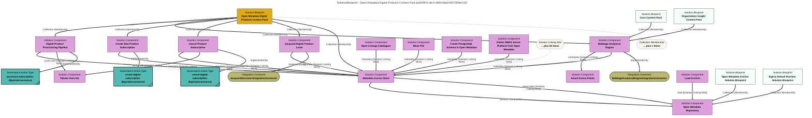

```mermaid
---
title: SolutionBlueprint - Open Metadata Digital Products Content Pack [ea509f7a-de1f-4864-bbbd-6f373f49e132]
---
flowchart TD
%%{init: {"flowchart": {"htmlLabels": false}} }%%

1@{ shape: rounded, label: "*Solution Blueprint*
**Open Metadata Digital Products Content Pack**"}
2@{ shape: rect, label: "*Solution Component*
**Digital Product Provisioning Pipeline**"}
1==>|"Collection Membership"|2
3@{ shape: rect, label: "*Solution Component*
**Metadata Access Store**"}
2==>|"metadata [Solution Linking Wire]"|3
4@{ shape: rect, label: "*Solution Component*
**Tabular Data Set**"}
2==>|"works with [Solution Linking Wire]"|4
5@{ shape: tag-rect, label: "*Governance Action Type*
**provision-subscription (EgeriaGovernance)**"}
2==>|"Implemented By"|5
6@{ shape: rect, label: "*Solution Component*
**Babbage Analytical Engine**"}
1==>|"Collection Membership"|6
7@{ shape: rect, label: "*Solution Component*
**Award Karma Points**"}
6==>|"schedules [Solution Linking Wire]"|7
6==>|"metadata [Solution Linking Wire]"|3
8@{ shape: rect, label: "*Solution Blueprint*
**Core Content Pack**"}
8==>|"Collection Membership"|6
9@{ shape: rect, label: "*Solution Blueprint*
**Organization Insight Content Pack**"}
9==>|"Collection Membership"|6
10@{ shape: stadium, label: "*Integration Connector*
**BabbageAnalyticalEngineIntegrationConnector**"}
6==>|"Implemented By"|10
11@{ shape: rect, label: "*Solution Component*
**Create New Product Subscription**"}
1==>|"Collection Membership"|11
11==>|"metadata [Solution Linking Wire]"|3
12@{ shape: tag-rect, label: "*Governance Action Type*
**create-digital-subscription (EgeriaGovernance)**"}
11==>|"Implemented By"|12
13@{ shape: rect, label: "*Solution Component*
**Cancel Product Subscription**"}
1==>|"Collection Membership"|13
13==>|"metadata [Solution Linking Wire]"|3
13==>|"works with [Solution Linking Wire]"|4
14@{ shape: tag-rect, label: "*Governance Action Type*
**cancel-digital-subscription (EgeriaGovernance)**"}
13==>|"Implemented By"|14
15@{ shape: rect, label: "*Solution Component*
**Jacquard Digital Product Loom**"}
1==>|"Collection Membership"|15
15==>|"metadata [Solution Linking Wire]"|3
16@{ shape: stadium, label: "*Integration Connector*
**JacquardHarvesterIntegrationConnector**"}
15==>|"Implemented By"|16
1==>|"Collection Membership"|3
17@{ shape: rect, label: "*Solution Component*
**Open Metadata Repository**"}
3==>|"Solution Composition"|17
18@{ shape: rect, label: "*Solution Component*
**Load Archive**"}
18==>|"load [Solution Linking Wire]"|17
3==>|"stores data [Solution Linking Wire]"|17
19@{ shape: rect, label: "*Solution Blueprint*
**Open Metadata Archive Solution Blueprint**"}
19==>|"Collection Membership"|17
20@{ shape: rect, label: "*Solution Blueprint*
**Egeria Default Runtime Solution Blueprint**"}
20==>|"Collection Membership"|17
21@{ shape: rect, label: "*Solution Component*
**Open Lineage Cataloguer**"}
21==>|"metadata [Solution Linking Wire]"|3
22@{ shape: rect, label: "*Solution Component*
**Move File**"}
22==>|"metadata [Solution Linking Wire]"|3
23@{ shape: rect, label: "*Solution Component*
**Create PostgreSQL Schema in Open Metadata**"}
23==>|"metadata [Solution Linking Wire]"|3
24@{ shape: rect, label: "*Solution Component*
**Delete OMAG Server Platform from Open Metadata**"}
24==>|"metadata [Solution Linking Wire]"|3
25@{ shape: stadium, label: "*Solution Linking Wire*
**... plus 82 Items**"}
25-.->3
26@{ shape: stadium, label: "*Collection Membership*
**... plus 1 Items**"}
1-.->26
style 22 color:#000000, fill:#dda0dd, stroke:#000000
style 23 color:#000000, fill:#dda0dd, stroke:#000000
style 24 color:#000000, fill:#dda0dd, stroke:#000000
style 25 color:#000000, fill:#F9F7ED, stroke:#b7c0c7
style 26 color:#000000, fill:#F9F7ED, stroke:#b7c0c7
style 10 color:#000000, fill:#bdb76b, stroke:#004563
style 11 color:#000000, fill:#dda0dd, stroke:#000000
style 12 color:#000000, fill:#53bbb4, stroke:#000000
style 13 color:#000000, fill:#dda0dd, stroke:#000000
style 14 color:#000000, fill:#53bbb4, stroke:#000000
style 15 color:#000000, fill:#dda0dd, stroke:#000000
style 16 color:#000000, fill:#bdb76b, stroke:#004563
style 17 color:#000000, fill:#dda0dd, stroke:#000000
style 18 color:#000000, fill:#dda0dd, stroke:#000000
style 19 color:#000000, fill:#f5fffa, stroke:#000000
style 1 color:#000000, fill:#e0ab18, stroke:#004563
style 2 color:#000000, fill:#dda0dd, stroke:#000000
style 3 color:#000000, fill:#dda0dd, stroke:#000000
style 4 color:#000000, fill:#dda0dd, stroke:#000000
style 5 color:#000000, fill:#53bbb4, stroke:#000000
style 6 color:#000000, fill:#dda0dd, stroke:#000000
style 7 color:#000000, fill:#dda0dd, stroke:#000000
style 8 color:#000000, fill:#f5fffa, stroke:#000000
style 9 color:#000000, fill:#f5fffa, stroke:#000000
style 20 color:#000000, fill:#f5fffa, stroke:#000000
style 21 color:#000000, fill:#dda0dd, stroke:#000000
click 11 "https://egeria-project.org/concepts/governance-action-type/" "Click for more documentation" _blank
click 22 "https://egeria-project.org/concepts/governance-action-type/" "Click for more documentation" _blank
click 23 "https://egeria-project.org/concepts/governance-action-type/" "Click for more documentation" _blank
click 13 "https://egeria-project.org/concepts/governance-action-type/" "Click for more documentation" _blank
click 24 "https://egeria-project.org/concepts/governance-action-type/" "Click for more documentation" _blank
click 15 "https://egeria-project.org/concepts/integration-connector/" "Click for more documentation" _blank
click 17 "https://egeria-project.org/concepts/open-metadata-repository/" "Click for more documentation" _blank
click 18 "https://egeria-project.org/concepts/open-metadata-archive/" "Click for more documentation" _blank
click 2 "https://egeria-project.org/concepts/governance-action-type/" "Click for more documentation" _blank
click 3 "https://egeria-project.org/concepts/metadata-access-store/" "Click for more documentation" _blank
click 4 "https://egeria-project.org/concepts/tabular-data-set/" "Click for more documentation" _blank
click 6 "https://egeria-project.org/concepts/integration-connector/" "Click for more documentation" _blank
click 7 "https://egeria-project.org/concepts/governance-action-type/" "Click for more documentation" _blank
click 21 "https://egeria-project.org/concepts/integration-connector/" "Click for more documentation" _blank
```
> Open Metadata Digital Products Content Pack: Solution blueprint showing the components that manage the Open Metadata Digital Product Catalog. (Extracted from 6.0-SNAPSHOT)
