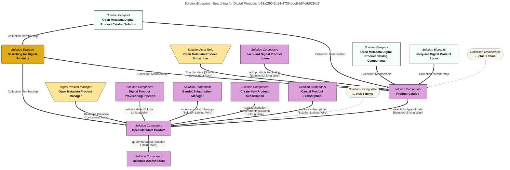

> Searching for Digital Products: Description of the processing when a potential consumer is searching the Open Metadata Digital Product Catalog for the right data for their project. (Extracted from 6.0-SNAPSHOT)
