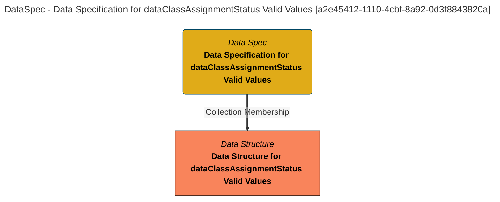

> Data Specification for dataClassAssignmentStatus Valid Values: The data specification lists the fields in the Valid Metadata Value Set: dataClassAssignmentStatus product. (Extracted from 6.0-SNAPSHOT)
