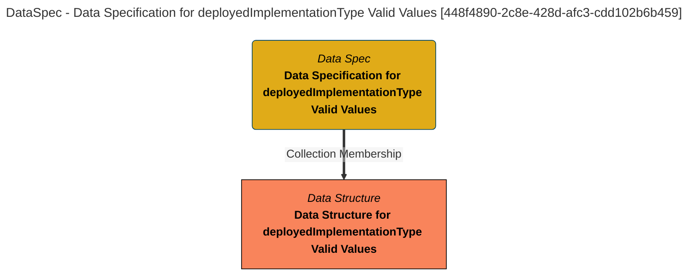

> Data Specification for deployedImplementationType Valid Values: The data specification lists the fields in the Valid Metadata Value Set: deployedImplementationType product. (Extracted from 6.0-SNAPSHOT)
