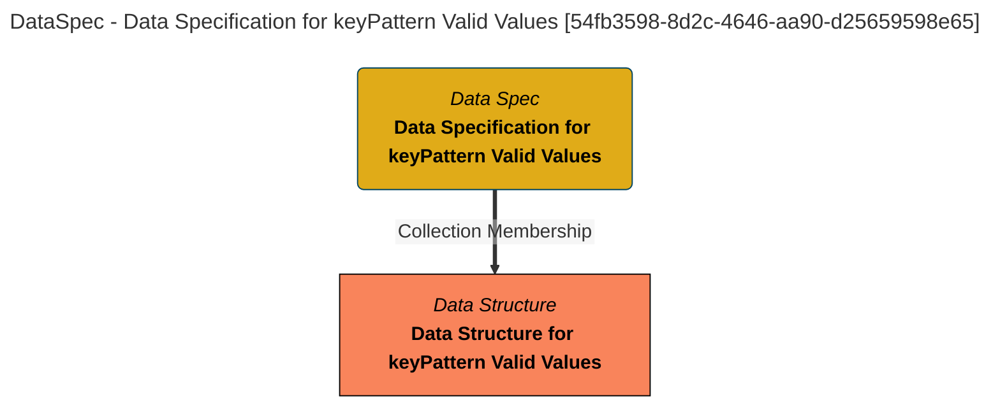

```mermaid
---
title: DataSpec - Data Specification for keyPattern Valid Values [54fb3598-8d2c-4646-aa90-d25659598e65]
---
flowchart TD
%%{init: {"flowchart": {"htmlLabels": false}} }%%

1@{ shape: rounded, label: "*Data Spec*
**Data Specification for keyPattern Valid Values**"}
2@{ shape: rect, label: "*Data Structure*
**Data Structure for keyPattern Valid Values**"}
1==>|"Collection Membership"|2
style 1 color:#000000, fill:#e0ab18, stroke:#004563
style 2 color:#000000, fill:#f9845b, stroke:#000000
```
> Data Specification for keyPattern Valid Values: The data specification lists the fields in the Valid Metadata Value Set: keyPattern product. (Extracted from 6.0-SNAPSHOT)
