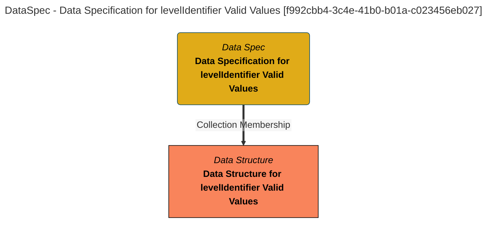

```mermaid
---
title: DataSpec - Data Specification for levelIdentifier Valid Values [f992cbb4-3c4e-41b0-b01a-c023456eb027]
---
flowchart TD
%%{init: {"flowchart": {"htmlLabels": false}} }%%

1@{ shape: rounded, label: "*Data Spec*
**Data Specification for levelIdentifier Valid Values**"}
2@{ shape: rect, label: "*Data Structure*
**Data Structure for levelIdentifier Valid Values**"}
1==>|"Collection Membership"|2
style 1 color:#000000, fill:#e0ab18, stroke:#004563
style 2 color:#000000, fill:#f9845b, stroke:#000000
```
> Data Specification for levelIdentifier Valid Values: The data specification lists the fields in the Valid Metadata Value Set: levelIdentifier product. (Extracted from 6.0-SNAPSHOT)
