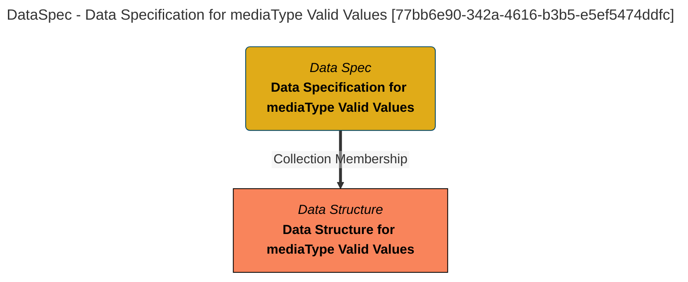

```mermaid
---
title: DataSpec - Data Specification for mediaType Valid Values [77bb6e90-342a-4616-b3b5-e5ef5474ddfc]
---
flowchart TD
%%{init: {"flowchart": {"htmlLabels": false}} }%%

1@{ shape: rounded, label: "*Data Spec*
**Data Specification for mediaType Valid Values**"}
2@{ shape: rect, label: "*Data Structure*
**Data Structure for mediaType Valid Values**"}
1==>|"Collection Membership"|2
style 1 color:#000000, fill:#e0ab18, stroke:#004563
style 2 color:#000000, fill:#f9845b, stroke:#000000
```
> Data Specification for mediaType Valid Values: The data specification lists the fields in the Valid Metadata Value Set: mediaType product. (Extracted from 6.0-SNAPSHOT)
