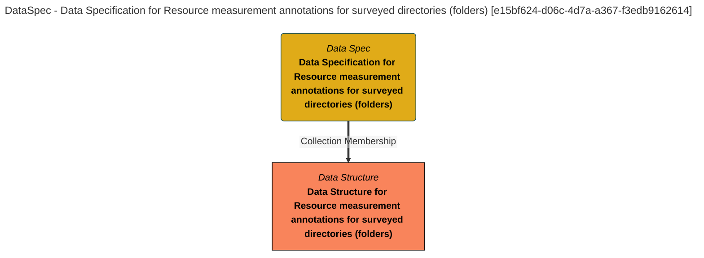

> Data Specification for Resource measurement annotations for surveyed directories (folders): The data specification lists the fields in the File Directory (Folder) Measurements product. (Extracted from 6.0-SNAPSHOT)
