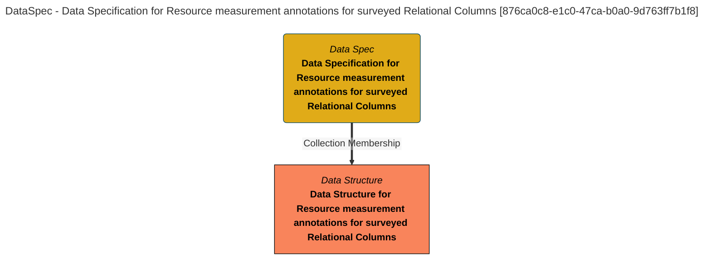

> Data Specification for Resource measurement annotations for surveyed Relational Columns: The data specification lists the fields in the Relational Column Measurements product. (Extracted from 6.0-SNAPSHOT)
