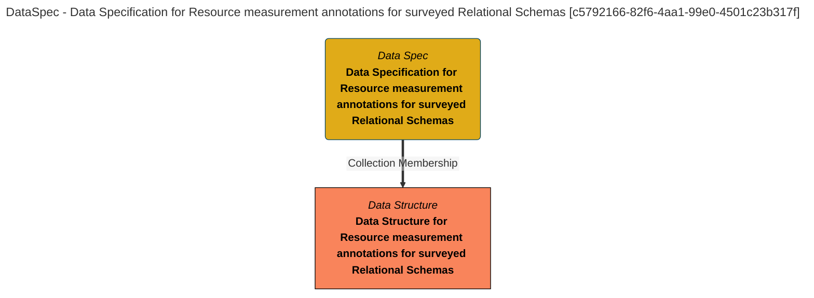

> Data Specification for Resource measurement annotations for surveyed Relational Schemas: The data specification lists the fields in the Relational Schema Measurements product. (Extracted from 6.0-SNAPSHOT)
