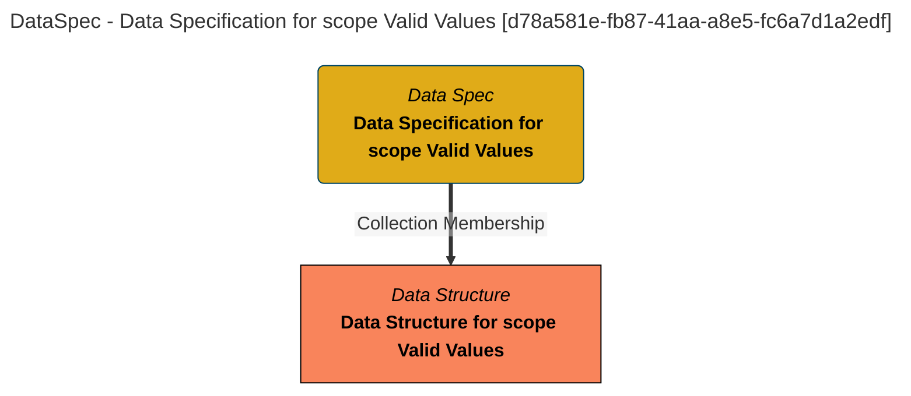

```mermaid
---
title: DataSpec - Data Specification for scope Valid Values [d78a581e-fb87-41aa-a8e5-fc6a7d1a2edf]
---
flowchart TD
%%{init: {"flowchart": {"htmlLabels": false}} }%%

1@{ shape: rounded, label: "*Data Spec*
**Data Specification for scope Valid Values**"}
2@{ shape: rect, label: "*Data Structure*
**Data Structure for scope Valid Values**"}
1==>|"Collection Membership"|2
style 1 color:#000000, fill:#e0ab18, stroke:#004563
style 2 color:#000000, fill:#f9845b, stroke:#000000
```
> Data Specification for scope Valid Values: The data specification lists the fields in the Valid Metadata Value Set: scope product. (Extracted from 6.0-SNAPSHOT)
