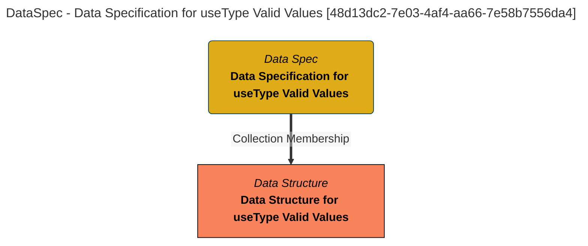

```mermaid
---
title: DataSpec - Data Specification for useType Valid Values [48d13dc2-7e03-4af4-aa66-7e58b7556da4]
---
flowchart TD
%%{init: {"flowchart": {"htmlLabels": false}} }%%

1@{ shape: rounded, label: "*Data Spec*
**Data Specification for useType Valid Values**"}
2@{ shape: rect, label: "*Data Structure*
**Data Structure for useType Valid Values**"}
1==>|"Collection Membership"|2
style 1 color:#000000, fill:#e0ab18, stroke:#004563
style 2 color:#000000, fill:#f9845b, stroke:#000000
```
> Data Specification for useType Valid Values: The data specification lists the fields in the Valid Metadata Value Set: useType product. (Extracted from 6.0-SNAPSHOT)
