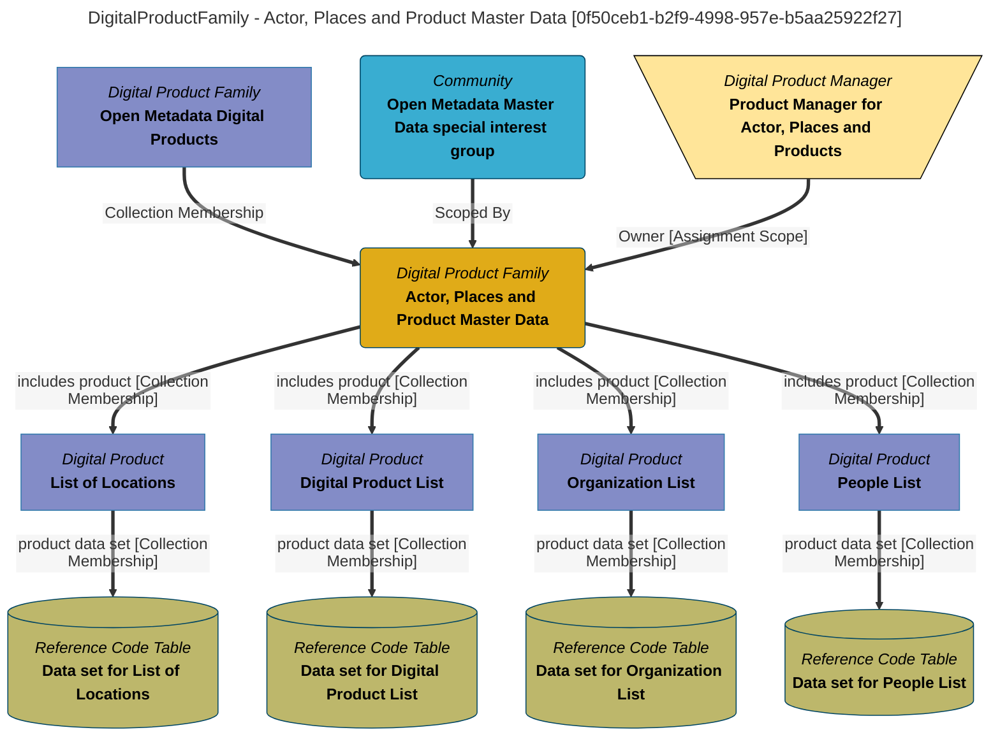

> Actor, Places and Product Master Data: Each product in this folder lists information held in the open metadata about people, organizations, users, teams, locations and digital products.  This type of data is called master data because it describes the key entities that the organization operates around.  As such, some form of this data appears in most data sets.  Each product in this folder is organized into a tabular data set, where each row is a specific (master data) entity.   These are designed to be used as standard values that can be used for validation or to ensure that data in digital products is consistent making it easier to join data from multiple products. (Extracted from 6.0-SNAPSHOT)
