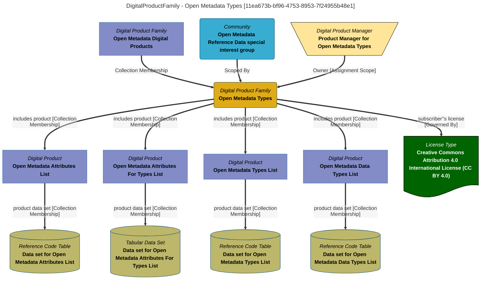

```mermaid
---
title: DigitalProductFamily - Open Metadata Types [11ea673b-bf96-4753-8953-7f24955b48e1]
---
flowchart TD
%%{init: {"flowchart": {"htmlLabels": false}} }%%

1@{ shape: rounded, label: "*Digital Product Family*
**Open Metadata Types**"}
2@{ shape: rect, label: "*Digital Product Family*
**Open Metadata Digital Products**"}
2==>|"Collection Membership"|1
3@{ shape: rect, label: "*Digital Product*
**Open Metadata Attributes List**"}
1==>|"includes product [Collection Membership]"|3
4@{ shape: cyl, label: "*Reference Code Table*
**Data set for Open Metadata Attributes List**"}
3==>|"product data set [Collection Membership]"|4
5@{ shape: rect, label: "*Digital Product*
**Open Metadata Attributes For Types List**"}
1==>|"includes product [Collection Membership]"|5
6@{ shape: cyl, label: "*Tabular Data Set*
**Data set for Open Metadata Attributes For Types List**"}
5==>|"product data set [Collection Membership]"|6
7@{ shape: rect, label: "*Digital Product*
**Open Metadata Types List**"}
1==>|"includes product [Collection Membership]"|7
8@{ shape: cyl, label: "*Reference Code Table*
**Data set for Open Metadata Types List**"}
7==>|"product data set [Collection Membership]"|8
9@{ shape: rect, label: "*Digital Product*
**Open Metadata Data Types List**"}
1==>|"includes product [Collection Membership]"|9
10@{ shape: cyl, label: "*Reference Code Table*
**Data set for Open Metadata Data Types List**"}
9==>|"product data set [Collection Membership]"|10
11@{ shape: rounded, label: "*Community*
**Open Metadata Reference Data special interest group**"}
11==>|"Scoped By"|1
12@{ shape: trap-t, label: "*Digital Product Manager*
**Product Manager for Open Metadata Types**"}
12==>|"Owner [Assignment Scope]"|1
13@{ shape: doc, label: "*License Type*
**Creative Commons Attribution 4.0 International License (CC BY 4.0)**"}
1==>|"subscriber''s license [Governed By]"|13
style 11 color:#000000, fill:#39add1, stroke:#004563
style 12 color:#000000, fill:#FFE599, stroke:#000000
style 13 color:#FFFFFF, fill:#006400, stroke:#000000
style 1 color:#000000, fill:#e0ab18, stroke:#004563
style 2 color:#000000, fill:#838cc7, stroke:#3079ab
style 3 color:#000000, fill:#838cc7, stroke:#3079ab
style 4 color:#000000, fill:#bdb76b, stroke:#004563
style 5 color:#000000, fill:#838cc7, stroke:#3079ab
style 6 color:#000000, fill:#bdb76b, stroke:#004563
style 7 color:#000000, fill:#838cc7, stroke:#3079ab
style 8 color:#000000, fill:#bdb76b, stroke:#004563
style 9 color:#000000, fill:#838cc7, stroke:#3079ab
style 10 color:#000000, fill:#bdb76b, stroke:#004563
```
> Open Metadata Types: Each product in this folder provides a perspective on the open metadata types. (Extracted from 6.0-SNAPSHOT)
