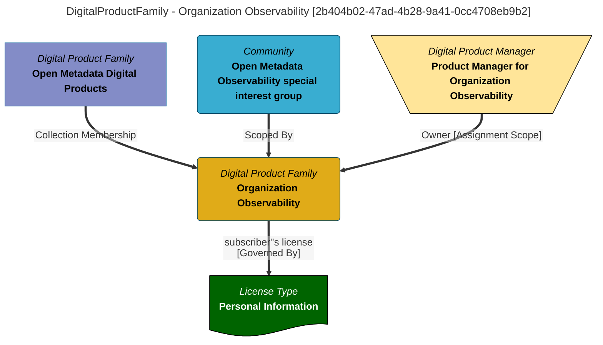

> Organization Observability: Each product in this folder publishes insights about the activity of the organization observed through the open metadata ecosystem.  The latest insight is published to subscribers on a regular basis.  Subscribers can maintain a history of the insight publications, or treat each one as a trigger to perform specific processing. (Extracted from 6.0-SNAPSHOT)
