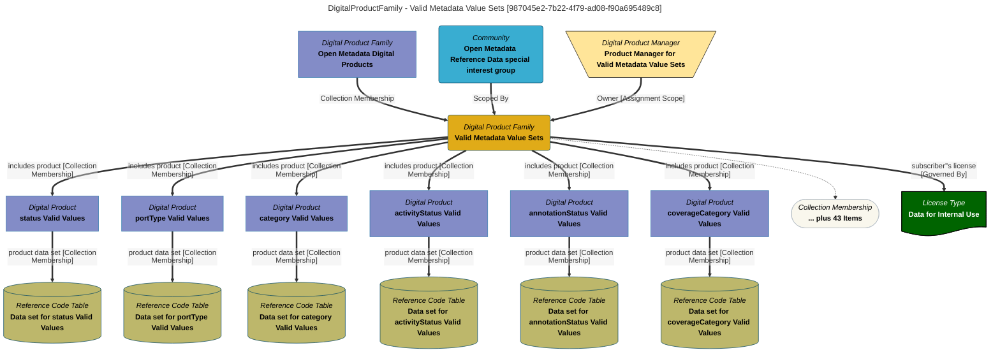

> Valid Metadata Value Sets: Each product in this folder is an extract of the valid metadata values.  The valid metadata values are organized into a tabular data set, where each row is a specific valid value.  These products can be used as standard reference values when building other digital products to help consumers join data from multiple products together. (Extracted from 6.0-SNAPSHOT)
