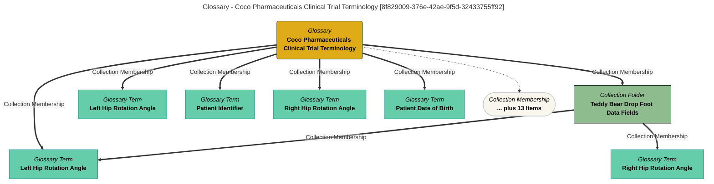

> Coco Pharmaceuticals Clinical Trial Terminology: This glossary describes terminology invented for the fictitious Coco Pharmaceuticals case study.  Used in scenarios that show techniques for the collection and processing of data associated with a clinical trial. (Extracted from 6.0-SNAPSHOT)
