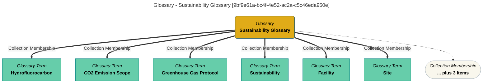

```mermaid
---
title: Glossary - Sustainability Glossary [9bf9e61a-bc4f-4e52-ac2a-c5c46eda950e]
---
flowchart TD
%%{init: {"flowchart": {"htmlLabels": false}} }%%

1@{ shape: rounded, label: "*Glossary*
**Sustainability Glossary**"}
2@{ shape: rect, label: "*Glossary Term*
**Hydrofluorocarbon**"}
1==>|"Collection Membership"|2
3@{ shape: rect, label: "*Glossary Term*
**CO2 Emission Scope**"}
1==>|"Collection Membership"|3
4@{ shape: rect, label: "*Glossary Term*
**Greenhouse Gas Protocol**"}
1==>|"Collection Membership"|4
5@{ shape: rect, label: "*Glossary Term*
**Sustainability**"}
1==>|"Collection Membership"|5
6@{ shape: rect, label: "*Glossary Term*
**Facility**"}
1==>|"Collection Membership"|6
7@{ shape: rect, label: "*Glossary Term*
**Site**"}
1==>|"Collection Membership"|7
8@{ shape: stadium, label: "*Collection Membership*
**... plus 3 Items**"}
1-.->8
style 1 color:#000000, fill:#e0ab18, stroke:#004563
style 2 color:#000000, fill:#66cdaa, stroke:#008080
style 3 color:#000000, fill:#66cdaa, stroke:#008080
style 4 color:#000000, fill:#66cdaa, stroke:#008080
style 5 color:#000000, fill:#66cdaa, stroke:#008080
style 6 color:#000000, fill:#66cdaa, stroke:#008080
style 7 color:#000000, fill:#66cdaa, stroke:#008080
style 8 color:#000000, fill:#F9F7ED, stroke:#b7c0c7
click 2 "https://en.wikipedia.org/wiki/Hydrofluorocarbon" "Click for more documentation" _blank
click 4 "https://ghgprotocol.org" "Click for more documentation" _blank
click 5 "https://en.wikipedia.org/wiki/Sustainability" "Click for more documentation" _blank
```
> Sustainability Glossary: Terminology associated with Coco Pharmaceutical''s sustainability initiative. (Extracted from 6.0-SNAPSHOT)
