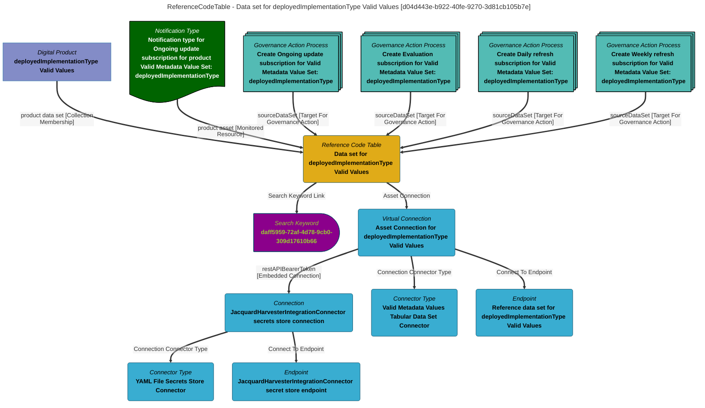

```mermaid
---
title: ReferenceCodeTable - Data set for deployedImplementationType Valid Values [d04d443e-b922-40fe-9270-3d81cb105b7e]
---
flowchart TD
%%{init: {"flowchart": {"htmlLabels": false}} }%%

1@{ shape: rounded, label: "*Reference Code Table*
**Data set for deployedImplementationType Valid Values**"}
2@{ shape: delay, label: "*Search Keyword*
**daff5959-72af-4d78-9cb0-309d17610b66**"}
1==>|"Search Keyword Link"|2
3@{ shape: rect, label: "*Digital Product*
**deployedImplementationType Valid Values**"}
3==>|"product data set [Collection Membership]"|1
4@{ shape: rounded, label: "*Virtual Connection*
**Asset Connection for deployedImplementationType Valid Values**"}
1==>|"Asset Connection"|4
5@{ shape: rounded, label: "*Connection*
**JacquardHarvesterIntegrationConnector secrets store connection**"}
4==>|"restAPIBearerToken [Embedded Connection]"|5
6@{ shape: rounded, label: "*Connector Type*
**YAML File Secrets Store Connector**"}
5==>|"Connection Connector Type"|6
7@{ shape: rounded, label: "*Endpoint*
**JacquardHarvesterIntegrationConnector secret store endpoint**"}
5==>|"Connect To Endpoint"|7
8@{ shape: rounded, label: "*Connector Type*
**Valid Metadata Values Tabular Data Set Connector**"}
4==>|"Connection Connector Type"|8
9@{ shape: rounded, label: "*Endpoint*
**Reference data set for deployedImplementationType Valid Values**"}
4==>|"Connect To Endpoint"|9
10@{ shape: doc, label: "*Notification Type*
**Notification type for Ongoing update subscription for product Valid Metadata Value Set: deployedImplementationType**"}
10==>|"product asset [Monitored Resource]"|1
11@{ shape: processes, label: "*Governance Action Process*
**Create Ongoing update subscription for Valid Metadata Value Set: deployedImplementationType**"}
11==>|"sourceDataSet [Target For Governance Action]"|1
12@{ shape: processes, label: "*Governance Action Process*
**Create Evaluation subscription for Valid Metadata Value Set: deployedImplementationType**"}
12==>|"sourceDataSet [Target For Governance Action]"|1
13@{ shape: processes, label: "*Governance Action Process*
**Create Daily refresh subscription for Valid Metadata Value Set: deployedImplementationType**"}
13==>|"sourceDataSet [Target For Governance Action]"|1
14@{ shape: processes, label: "*Governance Action Process*
**Create Weekly refresh subscription for Valid Metadata Value Set: deployedImplementationType**"}
14==>|"sourceDataSet [Target For Governance Action]"|1
style 11 color:#000000, fill:#53bbb4, stroke:#000000
style 12 color:#000000, fill:#53bbb4, stroke:#000000
style 13 color:#000000, fill:#53bbb4, stroke:#000000
style 14 color:#000000, fill:#53bbb4, stroke:#000000
style 1 color:#000000, fill:#e0ab18, stroke:#004563
style 2 color:#9acd32, fill:#8b008b, stroke:#004563
style 3 color:#000000, fill:#838cc7, stroke:#3079ab
style 4 color:#000000, fill:#39add1, stroke:#004563
style 5 color:#000000, fill:#39add1, stroke:#004563
style 6 color:#000000, fill:#39add1, stroke:#004563
style 7 color:#000000, fill:#39add1, stroke:#004563
style 8 color:#000000, fill:#39add1, stroke:#004563
style 9 color:#000000, fill:#39add1, stroke:#004563
style 10 color:#FFFFFF, fill:#006400, stroke:#000000
```
> Data set for deployedImplementationType Valid Values: This asset represents the source of data for the digital product. (Extracted from 6.0-SNAPSHOT)
