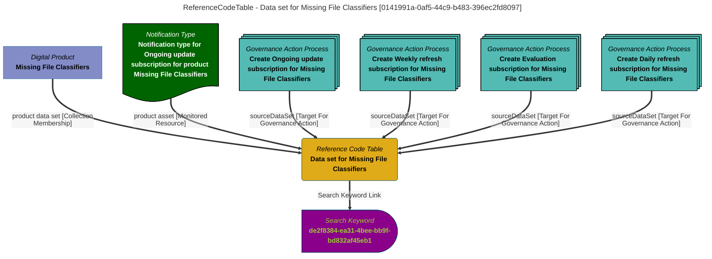

```mermaid
---
title: ReferenceCodeTable - Data set for Missing File Classifiers [0141991a-0af5-44c9-b483-396ec2fd8097]
---
flowchart TD
%%{init: {"flowchart": {"htmlLabels": false}} }%%

1@{ shape: rounded, label: "*Reference Code Table*
**Data set for Missing File Classifiers**"}
2@{ shape: delay, label: "*Search Keyword*
**de2f8384-ea31-4bee-bb9f-bd832af45eb1**"}
1==>|"Search Keyword Link"|2
3@{ shape: rect, label: "*Digital Product*
**Missing File Classifiers**"}
3==>|"product data set [Collection Membership]"|1
4@{ shape: doc, label: "*Notification Type*
**Notification type for Ongoing update subscription for product Missing File Classifiers**"}
4==>|"product asset [Monitored Resource]"|1
5@{ shape: processes, label: "*Governance Action Process*
**Create Ongoing update subscription for Missing File Classifiers**"}
5==>|"sourceDataSet [Target For Governance Action]"|1
6@{ shape: processes, label: "*Governance Action Process*
**Create Weekly refresh subscription for Missing File Classifiers**"}
6==>|"sourceDataSet [Target For Governance Action]"|1
7@{ shape: processes, label: "*Governance Action Process*
**Create Evaluation subscription for Missing File Classifiers**"}
7==>|"sourceDataSet [Target For Governance Action]"|1
8@{ shape: processes, label: "*Governance Action Process*
**Create Daily refresh subscription for Missing File Classifiers**"}
8==>|"sourceDataSet [Target For Governance Action]"|1
style 1 color:#000000, fill:#e0ab18, stroke:#004563
style 2 color:#9acd32, fill:#8b008b, stroke:#004563
style 3 color:#000000, fill:#838cc7, stroke:#3079ab
style 4 color:#FFFFFF, fill:#006400, stroke:#000000
style 5 color:#000000, fill:#53bbb4, stroke:#000000
style 6 color:#000000, fill:#53bbb4, stroke:#000000
style 7 color:#000000, fill:#53bbb4, stroke:#000000
style 8 color:#000000, fill:#53bbb4, stroke:#000000
```
> Data set for Missing File Classifiers: This asset represents the source of data for the digital product. (Extracted from 6.0-SNAPSHOT)
