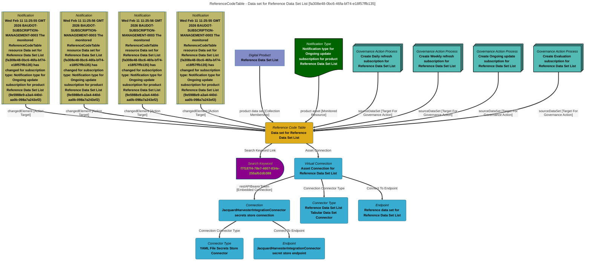

```mermaid
---
title: ReferenceCodeTable - Data set for Reference Data Set List [fa308e48-0bc6-46fa-bf74-e18f57ffb135]
---
flowchart TD
%%{init: {"flowchart": {"htmlLabels": false}} }%%

1@{ shape: rounded, label: "*Reference Code Table*
**Data set for Reference Data Set List**"}
2@{ shape: delay, label: "*Search Keyword*
**f7f187f4-78e7-4607-834e-255afb2db388**"}
1==>|"Search Keyword Link"|2
3@{ shape: subproc, label: "*Notification*
**Wed Feb 11 11:25:55 GMT 2026 BAUDOT-SUBSCRIPTION-MANAGEMENT-0003 The monitored ReferenceCodeTable resource Data set for Reference Data Set List (fa308e48-0bc6-46fa-bf74-e18f57ffb135) has changed for subscription type: Notification type for Ongoing update subscription for product Reference Data Set List (9e5988e9-a3a4-440d-aa0b-098a7a243ef2)**"}
3==>|"changedElement [Action Target]"|1
4@{ shape: subproc, label: "*Notification*
**Wed Feb 11 11:25:56 GMT 2026 BAUDOT-SUBSCRIPTION-MANAGEMENT-0003 The monitored ReferenceCodeTable resource Data set for Reference Data Set List (fa308e48-0bc6-46fa-bf74-e18f57ffb135) has changed for subscription type: Notification type for Ongoing update subscription for product Reference Data Set List (9e5988e9-a3a4-440d-aa0b-098a7a243ef2)**"}
4==>|"changedElement [Action Target]"|1
5@{ shape: subproc, label: "*Notification*
**Wed Feb 11 11:25:56 GMT 2026 BAUDOT-SUBSCRIPTION-MANAGEMENT-0003 The monitored ReferenceCodeTable resource Data set for Reference Data Set List (fa308e48-0bc6-46fa-bf74-e18f57ffb135) has changed for subscription type: Notification type for Ongoing update subscription for product Reference Data Set List (9e5988e9-a3a4-440d-aa0b-098a7a243ef2)**"}
5==>|"changedElement [Action Target]"|1
6@{ shape: subproc, label: "*Notification*
**Wed Feb 11 11:25:55 GMT 2026 BAUDOT-SUBSCRIPTION-MANAGEMENT-0003 The monitored ReferenceCodeTable resource Data set for Reference Data Set List (fa308e48-0bc6-46fa-bf74-e18f57ffb135) has changed for subscription type: Notification type for Ongoing update subscription for product Reference Data Set List (9e5988e9-a3a4-440d-aa0b-098a7a243ef2)**"}
6==>|"changedElement [Action Target]"|1
7@{ shape: rect, label: "*Digital Product*
**Reference Data Set List**"}
7==>|"product data set [Collection Membership]"|1
8@{ shape: rounded, label: "*Virtual Connection*
**Asset Connection for Reference Data Set List**"}
1==>|"Asset Connection"|8
9@{ shape: rounded, label: "*Connection*
**JacquardHarvesterIntegrationConnector secrets store connection**"}
8==>|"restAPIBearerToken [Embedded Connection]"|9
10@{ shape: rounded, label: "*Connector Type*
**YAML File Secrets Store Connector**"}
9==>|"Connection Connector Type"|10
11@{ shape: rounded, label: "*Endpoint*
**JacquardHarvesterIntegrationConnector secret store endpoint**"}
9==>|"Connect To Endpoint"|11
12@{ shape: rounded, label: "*Connector Type*
**Reference Data Set List Tabular Data Set Connector**"}
8==>|"Connection Connector Type"|12
13@{ shape: rounded, label: "*Endpoint*
**Reference data set for Reference Data Set List**"}
8==>|"Connect To Endpoint"|13
14@{ shape: doc, label: "*Notification Type*
**Notification type for Ongoing update subscription for product Reference Data Set List**"}
14==>|"product asset [Monitored Resource]"|1
15@{ shape: processes, label: "*Governance Action Process*
**Create Daily refresh subscription for Reference Data Set List**"}
15==>|"sourceDataSet [Target For Governance Action]"|1
16@{ shape: processes, label: "*Governance Action Process*
**Create Weekly refresh subscription for Reference Data Set List**"}
16==>|"sourceDataSet [Target For Governance Action]"|1
17@{ shape: processes, label: "*Governance Action Process*
**Create Ongoing update subscription for Reference Data Set List**"}
17==>|"sourceDataSet [Target For Governance Action]"|1
18@{ shape: processes, label: "*Governance Action Process*
**Create Evaluation subscription for Reference Data Set List**"}
18==>|"sourceDataSet [Target For Governance Action]"|1
style 11 color:#000000, fill:#39add1, stroke:#004563
style 12 color:#000000, fill:#39add1, stroke:#004563
style 13 color:#000000, fill:#39add1, stroke:#004563
style 14 color:#FFFFFF, fill:#006400, stroke:#000000
style 15 color:#000000, fill:#53bbb4, stroke:#000000
style 16 color:#000000, fill:#53bbb4, stroke:#000000
style 17 color:#000000, fill:#53bbb4, stroke:#000000
style 18 color:#000000, fill:#53bbb4, stroke:#000000
style 1 color:#000000, fill:#e0ab18, stroke:#004563
style 2 color:#9acd32, fill:#8b008b, stroke:#004563
style 3 color:#000000, fill:#bdb76b, stroke:#004563
style 4 color:#000000, fill:#bdb76b, stroke:#004563
style 5 color:#000000, fill:#bdb76b, stroke:#004563
style 6 color:#000000, fill:#bdb76b, stroke:#004563
style 7 color:#000000, fill:#838cc7, stroke:#3079ab
style 8 color:#000000, fill:#39add1, stroke:#004563
style 9 color:#000000, fill:#39add1, stroke:#004563
style 10 color:#000000, fill:#39add1, stroke:#004563
```
> Data set for Reference Data Set List: This asset represents the source of data for the digital product. (Extracted from 6.0-SNAPSHOT)
