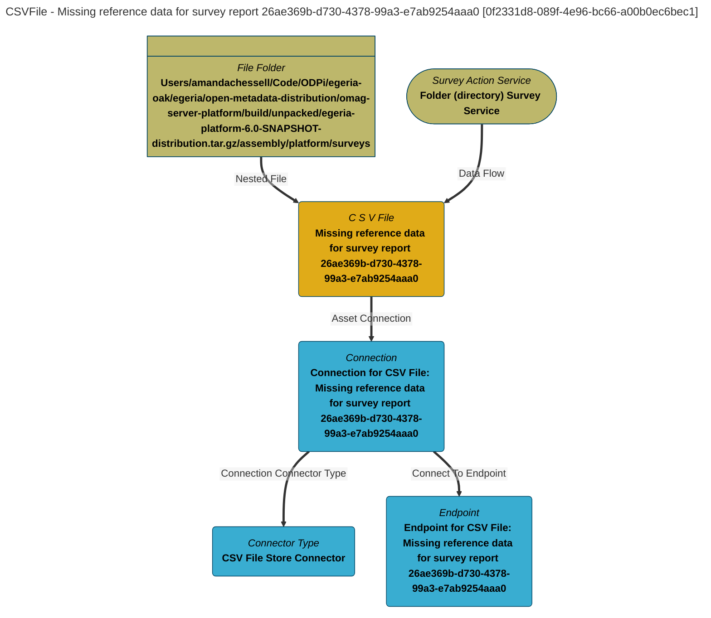

```mermaid
---
title: CSVFile - Missing reference data for survey report 26ae369b-d730-4378-99a3-e7ab9254aaa0 [0f2331d8-089f-4e96-bc66-a00b0ec6bec1]
---
flowchart TD
%%{init: {"flowchart": {"htmlLabels": false}} }%%

1@{ shape: rounded, label: "*C S V File*
**Missing reference data for survey report 26ae369b-d730-4378-99a3-e7ab9254aaa0**"}
2@{ shape: rounded, label: "*Connection*
**Connection for CSV File: Missing reference data for survey report 26ae369b-d730-4378-99a3-e7ab9254aaa0**"}
1==>|"Asset Connection"|2
3@{ shape: rounded, label: "*Connector Type*
**CSV File Store Connector**"}
2==>|"Connection Connector Type"|3
4@{ shape: rounded, label: "*Endpoint*
**Endpoint for CSV File: Missing reference data for survey report 26ae369b-d730-4378-99a3-e7ab9254aaa0**"}
2==>|"Connect To Endpoint"|4
5@{ shape: div-rect, label: "*File Folder*
**Users/amandachessell/Code/ODPi/egeria-oak/egeria/open-metadata-distribution/omag-server-platform/build/unpacked/egeria-platform-6.0-SNAPSHOT-distribution.tar.gz/assembly/platform/surveys**"}
5==>|"Nested File"|1
6@{ shape: stadium, label: "*Survey Action Service*
**Folder (directory) Survey Service**"}
6==>|"Data Flow"|1
style 1 color:#000000, fill:#e0ab18, stroke:#004563
style 2 color:#000000, fill:#39add1, stroke:#004563
style 3 color:#000000, fill:#39add1, stroke:#004563
style 4 color:#000000, fill:#39add1, stroke:#004563
style 5 color:#000000, fill:#bdb76b, stroke:#004563
style 6 color:#000000, fill:#bdb76b, stroke:#004563
```
> Missing reference data for survey report 26ae369b-d730-4378-99a3-e7ab9254aaa0: Shows the files that could not be correctly classified from the reference data. (Extracted from 6.0-SNAPSHOT)
