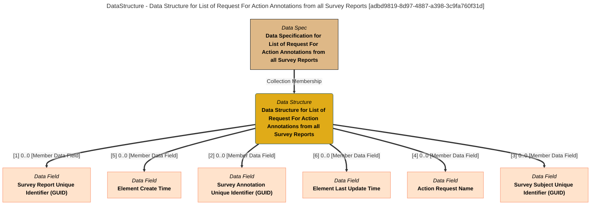

> Data Structure for List of Request For Action Annotations from all Survey Reports: The data structure lists the fields in the Request For Action Annotations List product. (Extracted from 6.0-SNAPSHOT)
