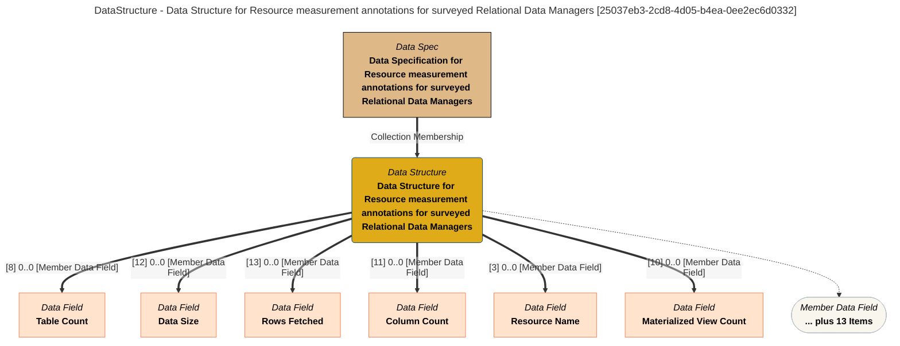

> Data Structure for Resource measurement annotations for surveyed Relational Data Managers: The data structure lists the fields in the Relational Data Manager Measurements product. (Extracted from 6.0-SNAPSHOT)
