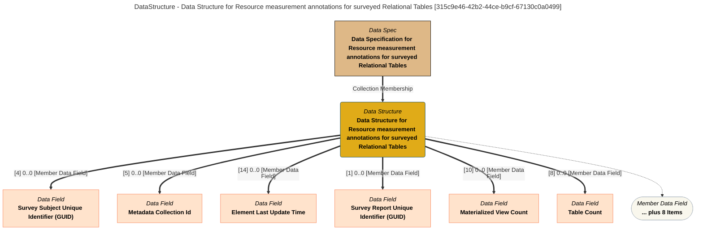

> Data Structure for Resource measurement annotations for surveyed Relational Tables: The data structure lists the fields in the Relational Table Measurements product. (Extracted from 6.0-SNAPSHOT)
