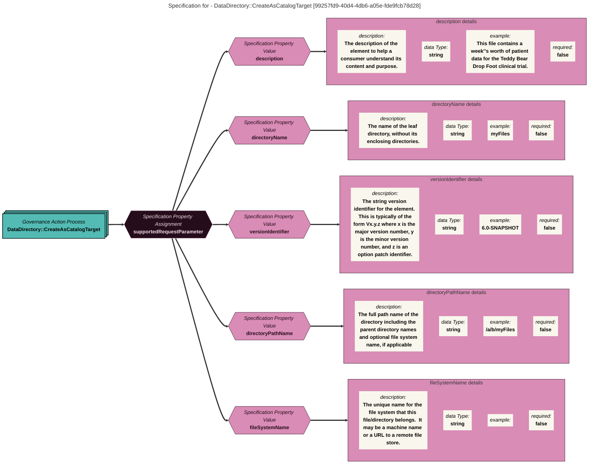

```mermaid
---
title: Specification for - DataDirectory::CreateAsCatalogTarget [99257fd9-40d4-4db6-a05e-fde9fcb78d28]
---
flowchart LR
%%{init: {"flowchart": {"htmlLabels": false}} }%%

1@{ shape: processes, label: "*Governance Action Process*
**DataDirectory::CreateAsCatalogTarget**"}
2@{ shape: hex, label: "*Specification Property Assignment*
**supportedRequestParameter**"}
1==>2
3@{ shape: hex, label: "*Specification Property Value*
**description**"}
2==>3
subgraph 4 [description details]
5@{ shape: text, label: "*description:*
**The description of the element to help a consumer understand its content and purpose.**"}
6@{ shape: text, label: "*data Type:*
**string**"}
7@{ shape: text, label: "*example:*
**This file contains a week''s worth of patient data for the Teddy Bear Drop Foot clinical trial.**"}
8@{ shape: text, label: "*required:*
**false**"}
end
3==>4
9@{ shape: hex, label: "*Specification Property Value*
**directoryName**"}
2==>9
subgraph 10 [directoryName details]
11@{ shape: text, label: "*description:*
**The name of the leaf directory, without its enclosing directories.**"}
12@{ shape: text, label: "*data Type:*
**string**"}
13@{ shape: text, label: "*example:*
**myFiles**"}
14@{ shape: text, label: "*required:*
**false**"}
end
9==>10
15@{ shape: hex, label: "*Specification Property Value*
**versionIdentifier**"}
2==>15
subgraph 16 [versionIdentifier details]
17@{ shape: text, label: "*description:*
**The string version identifier for the element.  This is typically of the form Vx.y.z where x is the major version number, y is the minor version number, and z is an option patch identifier.**"}
18@{ shape: text, label: "*data Type:*
**string**"}
19@{ shape: text, label: "*example:*
**6.0-SNAPSHOT**"}
20@{ shape: text, label: "*required:*
**false**"}
end
15==>16
21@{ shape: hex, label: "*Specification Property Value*
**directoryPathName**"}
2==>21
subgraph 22 [directoryPathName details]
23@{ shape: text, label: "*description:*
**The full path name of the directory including the parent directory names and optional file system name, if applicable**"}
24@{ shape: text, label: "*data Type:*
**string**"}
25@{ shape: text, label: "*example:*
**/a/b/myFiles**"}
26@{ shape: text, label: "*required:*
**false**"}
end
21==>22
27@{ shape: hex, label: "*Specification Property Value*
**fileSystemName**"}
2==>27
subgraph 28 [fileSystemName details]
29@{ shape: text, label: "*description:*
**The unique name for the file system that this file/directory belongs.  It may be a machine name or a URL to a remote file store.**"}
30@{ shape: text, label: "*data Type:*
**string**"}
31@{ shape: text, label: "*example:*
"}
32@{ shape: text, label: "*required:*
**false**"}
end
27==>28
style 22 color:#260d1b, fill:#d98cb6, stroke:#260d1b
style 23 color:#000000, fill:#F9F7ED, stroke:#b7c0c7
style 24 color:#000000, fill:#F9F7ED, stroke:#b7c0c7
style 25 color:#000000, fill:#F9F7ED, stroke:#b7c0c7
style 26 color:#000000, fill:#F9F7ED, stroke:#b7c0c7
style 27 color:#260d1b, fill:#d98cb6, stroke:#260d1b
style 28 color:#260d1b, fill:#d98cb6, stroke:#260d1b
style 29 color:#000000, fill:#F9F7ED, stroke:#b7c0c7
style 30 color:#000000, fill:#F9F7ED, stroke:#b7c0c7
style 31 color:#000000, fill:#F9F7ED, stroke:#b7c0c7
style 10 color:#260d1b, fill:#d98cb6, stroke:#260d1b
style 32 color:#000000, fill:#F9F7ED, stroke:#b7c0c7
style 11 color:#000000, fill:#F9F7ED, stroke:#b7c0c7
style 12 color:#000000, fill:#F9F7ED, stroke:#b7c0c7
style 13 color:#000000, fill:#F9F7ED, stroke:#b7c0c7
style 14 color:#000000, fill:#F9F7ED, stroke:#b7c0c7
style 15 color:#260d1b, fill:#d98cb6, stroke:#260d1b
style 16 color:#260d1b, fill:#d98cb6, stroke:#260d1b
style 17 color:#000000, fill:#F9F7ED, stroke:#b7c0c7
style 18 color:#000000, fill:#F9F7ED, stroke:#b7c0c7
style 19 color:#000000, fill:#F9F7ED, stroke:#b7c0c7
style 1 color:#000000, fill:#53bbb4, stroke:#000000
style 2 color:#f2d9e7, fill:#260d1b, stroke:#f2d9e7
style 3 color:#260d1b, fill:#d98cb6, stroke:#260d1b
style 4 color:#260d1b, fill:#d98cb6, stroke:#260d1b
style 5 color:#000000, fill:#F9F7ED, stroke:#b7c0c7
style 6 color:#000000, fill:#F9F7ED, stroke:#b7c0c7
style 7 color:#000000, fill:#F9F7ED, stroke:#b7c0c7
style 8 color:#000000, fill:#F9F7ED, stroke:#b7c0c7
style 9 color:#260d1b, fill:#d98cb6, stroke:#260d1b
style 20 color:#000000, fill:#F9F7ED, stroke:#b7c0c7
style 21 color:#260d1b, fill:#d98cb6, stroke:#260d1b
```
