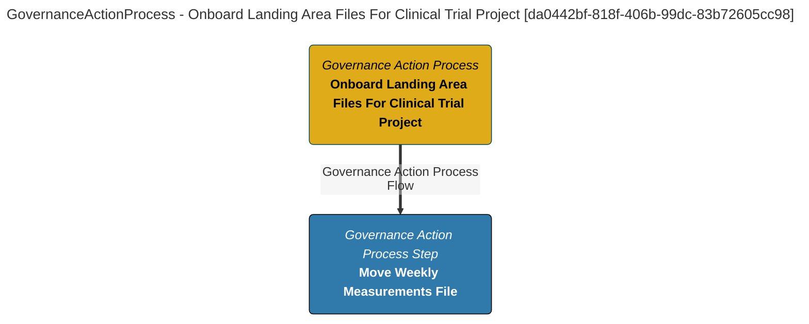

> Onboard Landing Area Files For Clinical Trial Project: Ensures that new files added to the landing are correctly catalogued in the data lake.

This process performs the follow function:
     1) The physical file is moved to the data lake and renamed,
     2) A new asset is created for the new file,
     3) Lineage is created between the original file asset and the new file asset,
     4) The owner and origin are assigned,
     5) The governance zones are assigned to make the new asset visible to the research team. (Extracted from V1.0)
